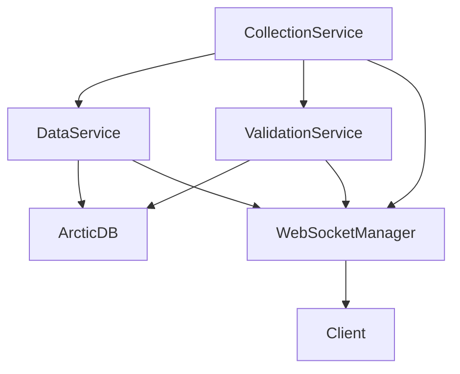

# System Architecture Documentation

## Table of Contents
1. [Overview](#overview)
2. [System Components](#system-components)
3. [Data Flow Architecture](#data-flow-architecture)
4. [Service Architecture](#service-architecture)
5. [Database Architecture](#database-architecture)
6. [WebSocket Architecture](#websocket-architecture)
7. [Security Architecture](#security-architecture)
8. [Performance Architecture](#performance-architecture)
9. [Deployment Architecture](#deployment-architecture)

## Overview

The Fuzzy OSS20 Trading Platform is built on a microservices-oriented architecture with clear separation of concerns between data collection, processing, storage, and presentation layers.

### Architecture Principles
- **Separation of Concerns**: Each service has a single responsibility
- **Scalability**: Horizontal scaling capability for all services
- **Real-time Processing**: Sub-second latency for tick data
- **Data Integrity**: Multiple validation layers
- **Fault Tolerance**: Automatic recovery and retry mechanisms

## System Components

### 1. Frontend Layer
```
┌─────────────────────────────────────────────────────────────┐
│                    React Application                         │
├───────────────┬─────────────┬─────────────┬─────────────────┤
│   Dashboard   │ DataExplorer│  Validation │    Backfill     │
│   Component   │  Component  │  Dashboard  │    Manager      │
├───────────────┴─────────────┴─────────────┴─────────────────┤
│                    Service Layer                             │
├───────────────┬─────────────┬─────────────┬─────────────────┤
│  API Service  │  WebSocket  │    Redux    │   Chart         │
│               │   Service   │    Store    │   Service       │
└───────────────┴─────────────┴─────────────┴─────────────────┘
```

#### Frontend Components

**Dashboard Component**
- Real-time market overview
- System health monitoring
- Active collection status
- Key performance metrics

**DataExplorer Component**
- AG-Grid for tick data visualization
- Plotly.js for candlestick charts
- Real-time streaming updates
- Export capabilities

**ValidationDashboard**
- 4-tier validation results
- Data quality metrics
- Alert management
- Historical validation trends

**BackfillManager**
- Gap detection interface
- Backfill scheduling
- Progress monitoring
- Error recovery

### 2. Backend Layer
```
┌─────────────────────────────────────────────────────────────┐
│                      FastAPI Application                     │
├───────────────┬─────────────┬─────────────┬─────────────────┤
│  API Routes   │  Middleware │  WebSocket  │   Background    │
│               │    Stack    │   Manager   │     Tasks       │
├───────────────┴─────────────┴─────────────┴─────────────────┤
│                     Service Layer                            │
├──────────┬──────────┬──────────┬──────────┬─────────────────┤
│Validation│   Data   │Collection│ Backfill │    Metrics      │
│ Service  │ Service  │ Service  │ Service  │    Service      │
└──────────┴──────────┴──────────┴──────────┴─────────────────┘
```

#### Backend Services

**ValidationService**
```python
class ValidationService:
    - validate_session_alignment()  # Check trading hours
    - validate_storage_location()   # Verify ArcticDB structure
    - validate_timezone_consistency() # Ensure ET timezone
    - validate_data_continuity()    # Detect gaps
```

**DataService**
```python
class DataService:
    - get_tick_data()      # Retrieve tick data
    - get_bar_data()       # Retrieve bar data
    - get_latest_tick()    # Get most recent tick
    - get_metadata()       # Access tier metadata
    - search_ticks()       # Advanced filtering
```

**CollectionService**
```python
class CollectionService:
    - collect_historical_ticks()  # Historical data
    - start_realtime_collection() # Live streaming
    - stop_realtime_collection()  # Stop streaming
    - backfill_data()            # Fill gaps
    - check_data_health()        # Health monitoring
```

### 3. Data Layer
```
┌─────────────────────────────────────────────────────────────┐
│                        Data Sources                          │
├─────────────────────────┬───────────────────────────────────┤
│       IQFeed API        │         External APIs             │
├─────────────────────────┴───────────────────────────────────┤
│                    Collection Layer                          │
├─────────────────────────────────────────────────────────────┤
│                     Storage Layer                            │
├──────────────┬──────────────┬──────────────┬───────────────┤
│   ArcticDB   │  PostgreSQL  │    Redis     │  File System  │
│  (Time-series)│  (Metadata) │   (Cache)    │   (Logs)      │
└──────────────┴──────────────┴──────────────┴───────────────┘
```

## Data Flow Architecture

### 1. Real-time Data Flow
```
IQFeed → CollectionService → Validation → ArcticDB
                ↓
         WebSocketManager
                ↓
         Client Updates
```

### 2. Historical Data Flow
```
Request → DataService → ArcticDB → Response
            ↓
        Validation
            ↓
        Transform
```

### 3. Validation Flow
```
Raw Data → Tier 1 Validation → Tier 2 Validation
              ↓                     ↓
          Core Checks          Quality Metrics
              ↓                     ↓
         Store/Reject          Alerts/Reports
```

## Service Architecture

### Microservice Communication

```yaml
Service Communication Matrix:
  DataService:
    - Reads: ArcticDB, PostgreSQL, Redis
    - Writes: Redis (cache)
    - Publishes: Data events

  CollectionService:
    - Reads: IQFeed API
    - Writes: ArcticDB, PostgreSQL
    - Publishes: Collection events

  ValidationService:
    - Reads: ArcticDB, PostgreSQL
    - Writes: PostgreSQL (results)
    - Publishes: Validation events

  WebSocketManager:
    - Subscribes: All events
    - Broadcasts: Client updates
```

### Service Dependencies



## Database Architecture

### ArcticDB Structure
```
Libraries:
├── tick_data/
│   └── {asset_class}/{symbol}/{date}
├── bars_time_bars/
│   └── {symbol}/{interval}/{date}
├── bars_volume_bars/
│   └── {symbol}/{volume}/{date}
├── metadata_tier1/
│   └── {symbol}/{interval}/{date}/tier1
├── metadata_tier2/
│   └── {symbol}/{interval}/{date}/tier2
└── metadata_tier3/
    └── {symbol}/{interval}/{date}/tier3
```

### PostgreSQL Schema
```sql
-- System configuration
CREATE TABLE system_config (
    key VARCHAR(255) PRIMARY KEY,
    value JSONB,
    updated_at TIMESTAMP WITH TIME ZONE
);

-- Validation results
CREATE TABLE validation_results (
    id SERIAL PRIMARY KEY,
    symbol VARCHAR(10),
    validation_type VARCHAR(50),
    status VARCHAR(20),
    details JSONB,
    created_at TIMESTAMP WITH TIME ZONE
);

-- Collection tasks
CREATE TABLE collection_tasks (
    id SERIAL PRIMARY KEY,
    task_id VARCHAR(100) UNIQUE,
    symbol VARCHAR(10),
    task_type VARCHAR(50),
    status VARCHAR(20),
    metadata JSONB,
    created_at TIMESTAMP WITH TIME ZONE,
    updated_at TIMESTAMP WITH TIME ZONE
);
```

### Redis Cache Structure
```
Keys:
- tick:{symbol}:latest        # Latest tick cache
- bars:{symbol}:{interval}    # Bar data cache
- validation:{symbol}:status  # Validation status
- collection:{task_id}        # Collection task status
- ws:clients                  # WebSocket client registry
```

## WebSocket Architecture

### Connection Management
```javascript
WebSocket Flow:
1. Client connects → Generate unique ID
2. Authentication → Validate credentials
3. Subscribe to channels → Update registry
4. Receive updates → Filter by subscription
5. Heartbeat → Keep alive
6. Disconnect → Cleanup subscriptions
```

### Message Protocol
```typescript
interface WebSocketMessage {
  type: MessageType;
  data: any;
  timestamp: string;
  sequence: number;
}

enum MessageType {
  SUBSCRIBE = 'subscribe',
  UNSUBSCRIBE = 'unsubscribe',
  TICK = 'tick',
  BAR = 'bar',
  VALIDATION = 'validation',
  STATUS = 'status',
  ERROR = 'error',
  HEARTBEAT = 'heartbeat'
}
```

### Subscription Management
```python
Subscription Types:
- Symbol subscriptions: tick:{symbol}
- Bar subscriptions: bar:{symbol}:{interval}
- Channel subscriptions: validation, collection, system
- Broadcast: all connected clients
```

## Security Architecture

### Authentication Flow
```
Client → Login → JWT Token → API Requests
                     ↓
              Token Validation
                     ↓
              Authorized Access
```

### Security Layers
1. **Network Security**
   - HTTPS/WSS encryption
   - CORS configuration
   - Rate limiting

2. **Application Security**
   - JWT authentication
   - Role-based access control
   - Input validation
   - SQL injection prevention

3. **Data Security**
   - Encryption at rest
   - Secure credential storage
   - Audit logging
   - Data masking

## Performance Architecture

### Optimization Strategies

#### 1. Caching Strategy
```
L1 Cache: Redis (hot data)
  - Latest ticks
  - Recent bars
  - Active validations

L2 Cache: Application memory
  - Frequently accessed metadata
  - Configuration data

L3 Storage: ArcticDB
  - Historical data
  - Compressed storage
```

#### 2. Query Optimization
```python
Optimization Techniques:
- Batch operations for bulk inserts
- Indexed queries on timestamps
- Partitioned tables by date
- Asynchronous processing
- Connection pooling
```

#### 3. Streaming Optimization
```javascript
WebSocket Optimizations:
- Message batching (100ms windows)
- Binary protocol for large datasets
- Compression for text messages
- Selective updates (delta only)
- Client-side throttling
```

### Performance Metrics

```yaml
Target Metrics:
  Tick Latency: < 100ms
  Bar Generation: < 500ms
  API Response: < 200ms (p95)
  WebSocket Latency: < 50ms
  Validation Processing: < 1s
  Data Write: 11,895 ticks/second
```

## Deployment Architecture

### Container Architecture
```
Docker Containers:
├── frontend (React app)
├── backend (FastAPI)
├── postgres (Database)
├── redis (Cache)
├── prometheus (Metrics)
├── grafana (Visualization)
└── nginx (Reverse proxy)
```

### Kubernetes Architecture (Production)
```yaml
Deployments:
  - frontend-deployment (3 replicas)
  - backend-deployment (5 replicas)
  - collection-worker (2 replicas)
  - validation-worker (2 replicas)

Services:
  - frontend-service (LoadBalancer)
  - backend-service (ClusterIP)
  - postgres-service (ClusterIP)
  - redis-service (ClusterIP)

ConfigMaps:
  - app-config
  - nginx-config

Secrets:
  - database-credentials
  - api-keys
  - jwt-secret
```

### Scaling Strategy

#### Horizontal Scaling
```
Components that scale horizontally:
- Frontend pods (3-10 replicas)
- Backend API (5-20 replicas)
- Collection workers (2-10 replicas)
- WebSocket servers (2-5 replicas)
```

#### Vertical Scaling
```
Components that scale vertically:
- PostgreSQL (up to 32GB RAM)
- Redis (up to 16GB RAM)
- ArcticDB storage (unlimited)
```

### Monitoring Architecture

```
Monitoring Stack:
├── Prometheus
│   ├── Application metrics
│   ├── System metrics
│   └── Custom metrics
├── Grafana
│   ├── Real-time dashboards
│   ├── Alert visualization
│   └── Historical analysis
└── Logging
    ├── Application logs (JSON)
    ├── Access logs
    └── Error tracking
```

## Disaster Recovery

### Backup Strategy
```
Backup Schedule:
- ArcticDB: Continuous replication
- PostgreSQL: Daily full, hourly incremental
- Redis: Snapshot every 5 minutes
- Configuration: Git versioned
```

### Recovery Procedures
```
RTO (Recovery Time Objective): 1 hour
RPO (Recovery Point Objective): 5 minutes

Recovery Steps:
1. Restore PostgreSQL from backup
2. Restore ArcticDB libraries
3. Clear and rebuild Redis cache
4. Restart all services
5. Validate data integrity
6. Resume operations
```

## Development Architecture

### Development Environment
```
Local Development:
├── Frontend: npm start (port 3000)
├── Backend: uvicorn --reload (port 8000)
├── Database: Docker PostgreSQL
├── Cache: Docker Redis
└── IQFeed: Local connection
```

### CI/CD Pipeline
```yaml
GitHub Actions Workflow:
  - Code checkout
  - Install dependencies
  - Run linting
  - Run unit tests
  - Run integration tests
  - Build Docker images
  - Push to registry
  - Deploy to staging
  - Run E2E tests
  - Deploy to production
```

## Future Architecture Considerations

### Planned Enhancements
1. **GraphQL API Layer**: For flexible querying
2. **Event Sourcing**: Complete audit trail
3. **CQRS Pattern**: Separate read/write models
4. **Service Mesh**: Istio for microservice communication
5. **Multi-region Deployment**: Geographic distribution
6. **Machine Learning Pipeline**: Predictive analytics
7. **Blockchain Integration**: Trade verification
8. **Cloud Migration**: AWS/Azure/GCP deployment

---

*Architecture Version: 1.0.0*
*Last Updated: January 17, 2025*