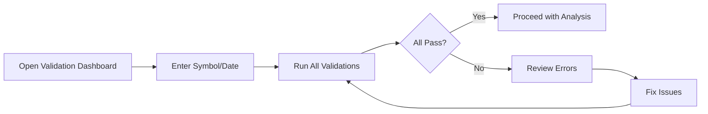
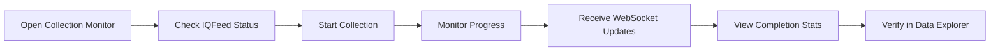

# Fuzzy OSS20 Trading Data Platform - Complete UI/UX Specification

## Table of Contents
1. [Executive Summary](#executive-summary)
2. [Technical Stack](#technical-stack)
3. [Functional Requirements](#functional-requirements)
4. [End User Experience](#end-user-experience)
5. [Database Architecture](#database-architecture)
6. [Backend Management System](#backend-management-system)
7. [Testing Strategy](#testing-strategy)
8. [Implementation Roadmap](#implementation-roadmap)

---

## Executive Summary

The Fuzzy OSS20 Trading Data Platform is a professional-grade, QuantConnect-inspired data management system designed for quantitative trading research. It provides real-time data collection from IQFeed, sophisticated bar generation algorithms, comprehensive data validation, and a modern web-based interface for data exploration and analysis.

### Key Features
- **Real-time Data Collection**: IQFeed integration with 11,895 ticks/second throughput
- **Universal Bar Processing**: 13 different bar types generated simultaneously
- **Two-Tier Metadata System**: Fast metadata access without loading full datasets
- **Data Validation Framework**: Ensures data integrity across sessions, storage, timezones, and continuity
- **Professional UI**: React-based interface matching QuantConnect's quality standards
- **Backend Management**: Automated data health checks, backfill capabilities, and monitoring

### Performance Targets
- API Response Time: < 100ms
- WebSocket Latency: < 50ms
- Page Load Time: < 3 seconds
- Concurrent Users: 100+
- Data Processing: 11,895 ticks/second

---

## Technical Stack

### Frontend Architecture

```yaml
Framework: React 18.2.0 with TypeScript 5.3.0
UI Components:
  - Ant Design 5.11.0 (Professional component library)
  - AG-Grid React 31.0.0 (Enterprise data grids)
  - Plotly.js 2.27.0 (Financial charts)
  - React Window 1.8.10 (Virtualization)

State Management:
  - Zustand 4.4.0 (Client state)
  - TanStack React Query 5.8.0 (Server state)
  - React Router DOM 6.20.0 (Navigation)

Real-time:
  - Native WebSocket API
  - Socket.io-client (fallback)

Development:
  - Vite (Build tool)
  - ESLint + Prettier (Code quality)
  - Jest + React Testing Library (Unit tests)
  - Playwright 1.40.0 (E2E tests)
```

### Backend Architecture

```yaml
Framework: FastAPI 0.104.1
Language: Python 3.10+

Core Libraries:
  - Uvicorn[standard] 0.24.0 (ASGI server)
  - Pydantic 2.5.0 (Data validation)
  - SQLAlchemy 2.0.23 (ORM)
  - AsyncPG 0.29.0 (PostgreSQL driver)

Data Processing:
  - Pandas 2.1.3 (Data manipulation)
  - NumPy 1.26.2 (Numerical computing)
  - ArcticDB (Existing - Time series storage)

Real-time:
  - WebSockets 12.0
  - Redis 5.0.1 (Pub/Sub)
  - Aioredis 2.0.1 (Async Redis)

Authentication:
  - Python-JOSE[cryptography] 3.3.0 (JWT)
  - Passlib 1.7.4 (Password hashing)
```

### Infrastructure

```yaml
Databases:
  - ArcticDB (LMDB): Time-series tick and bar data
  - PostgreSQL 15: Metadata, users, configurations
  - Redis 7: Caching, sessions, pub/sub

Deployment:
  - Docker + Docker Compose
  - Nginx (Reverse proxy)
  - GitHub Actions (CI/CD)

Monitoring:
  - Prometheus (Metrics)
  - Grafana (Dashboards)
  - Sentry (Error tracking)
```

---

## Functional Requirements

### 1. Data Collection & Storage

#### 1.1 IQFeed Integration
- **Requirement**: Collect real-time and historical tick data from IQFeed
- **Implementation**:
  - Use existing `IQFeedCollector` class
  - Support 180-day weekend advantage for historical data
  - Handle all 14 IQFeed fields, enrich to 43 fields via Pydantic
- **Acceptance Criteria**:
  - Successfully connect to IQFeed
  - Collect > 10,000 ticks per request
  - Store in correct ArcticDB library

#### 1.2 Universal Bar Generation
- **Requirement**: Generate 13 bar types from tick data
- **Implementation**:
  - Use existing `UniversalBarProcessor`
  - Process ticks at 11,895/second throughput
  - Generate Time, Tick, Volume, Dollar, Range bars
- **Acceptance Criteria**:
  - All 13 bar types generate correctly
  - Processing latency < 0.1ms per tick
  - Bars stored with Tier 2 metadata

#### 1.3 Data Validation
- **Requirement**: Validate data integrity across 4 dimensions
- **Implementation**:
  - Session alignment (pre-market, regular, after-hours)
  - Storage location verification
  - Timezone consistency (ET only)
  - Data continuity checks
- **Acceptance Criteria**:
  - All validations pass for production data
  - Clear error reporting for failures
  - Validation results cached for performance

### 2. User Interface Requirements

#### 2.1 Dataset Marketplace (QuantConnect-style)
- **Requirement**: Display available datasets as cards
- **Features**:
  - Card grid layout (responsive 3-4 columns)
  - Real-time status indicators
  - Statistics display (data points, date range, update frequency)
  - Action buttons (View Data, Configure, Export)
- **Acceptance Criteria**:
  - Page loads in < 2 seconds
  - Cards update in real-time
  - Smooth hover animations

#### 2.2 Data Explorer
- **Requirement**: Professional data viewing and analysis
- **Features**:
  - AG-Grid for tabular data (sorting, filtering, grouping)
  - Plotly charts (candlestick, volume profile, spread analysis)
  - Bar type selector (13 types)
  - Session filtering (pre/regular/after)
  - Export to CSV/Parquet
- **Acceptance Criteria**:
  - Handle 1M+ rows efficiently
  - Chart interactions < 50ms response
  - Export completes in < 5 seconds

#### 2.3 Validation Dashboard
- **Requirement**: Real-time data quality monitoring
- **Features**:
  - Four validation panels (session, storage, timezone, continuity)
  - Color-coded status (green/yellow/red)
  - Detailed error reporting
  - Historical validation results
- **Acceptance Criteria**:
  - Validation completes in < 3 seconds
  - Results persist for 24 hours
  - Clear actionable error messages

#### 2.4 Collection Monitor
- **Requirement**: Real-time collection status
- **Features**:
  - IQFeed connection status
  - Active collection progress
  - Throughput metrics (ticks/sec, bars/batch)
  - Storage usage statistics
  - WebSocket live updates
- **Acceptance Criteria**:
  - Updates every second
  - No memory leaks after 24 hours
  - Accurate throughput calculations

#### 2.5 DTN Indicators Dashboard
- **Requirement**: Market breadth and sentiment indicators
- **Features**:
  - NYSE/NASDAQ TICK display
  - TRIN calculations
  - Put/Call ratios
  - 20 Grok-derived metrics
  - Alert thresholds
- **Acceptance Criteria**:
  - Updates within 1 second of market data
  - Threshold alerts trigger correctly
  - Historical indicator charts available

### 3. API Requirements

#### 3.1 RESTful Endpoints
```python
# Validation
GET  /api/v1/validate/session/{symbol}/{date}
GET  /api/v1/validate/storage/{symbol}/{date}
GET  /api/v1/validate/timezone/{symbol}/{date}
GET  /api/v1/validate/continuity/{symbol}/{date}
GET  /api/v1/validate/all/{symbol}/{date}

# Data Access
GET  /api/v1/datasets
GET  /api/v1/data/{symbol}/ticks
GET  /api/v1/data/{symbol}/bars/{bar_type}
GET  /api/v1/data/{symbol}/metadata

# Collection
POST /api/v1/collection/start
GET  /api/v1/collection/status
DELETE /api/v1/collection/stop

# Indicators
GET  /api/v1/indicators/market-breadth
GET  /api/v1/indicators/options-flow
GET  /api/v1/indicators/grok-metrics

# Management
GET  /api/v1/admin/health-check
POST /api/v1/admin/backfill
GET  /api/v1/admin/data-status
POST /api/v1/admin/cleanup
```

#### 3.2 WebSocket Endpoints
```python
WS /ws/ticks/{symbol}          # Real-time tick stream
WS /ws/bars/{symbol}/{type}    # Bar completion events
WS /ws/collection              # Collection status
WS /ws/indicators              # Indicator updates
WS /ws/alerts                  # Threshold alerts
```

---

## End User Experience

### User Personas

#### 1. Quantitative Researcher (Primary)
- **Goals**: Analyze historical data, develop trading strategies
- **Needs**: Fast data access, multiple bar types, quality validation
- **Pain Points**: Slow data loading, missing data, timezone issues
- **Solution**: Pre-computed bars, validation dashboard, fast metadata access

#### 2. Data Engineer (Secondary)
- **Goals**: Maintain data pipeline, ensure quality
- **Needs**: Monitoring tools, backfill capabilities, error logs
- **Pain Points**: Silent failures, data gaps, storage issues
- **Solution**: Collection monitor, admin panel, detailed logging

#### 3. Portfolio Manager (Tertiary)
- **Goals**: Monitor market conditions, review signals
- **Needs**: Real-time indicators, alerts, reports
- **Pain Points**: Delayed data, missing alerts
- **Solution**: WebSocket updates, DTN dashboard, alert system

### User Journey Maps

#### Journey 1: First-Time Data Exploration

```mermaid
graph LR
    A[Land on Homepage] --> B[View Dataset Cards]
    B --> C[Select IQFeed Ticks]
    C --> D[Click View Data]
    D --> E[Data Explorer Opens]
    E --> F[Select Symbol AAPL]
    F --> G[Choose Date Range]
    G --> H[Select Bar Type]
    H --> I[View Chart & Grid]
    I --> J[Export Data]
```


#### Journey 2: Daily Data Validation


#### Journey 3: Real-Time Monitoring


### UI/UX Design Principles

#### 1. Visual Hierarchy
- **Primary Actions**: Bright blue buttons (Ant Design primary)
- **Secondary Actions**: Ghost buttons
- **Destructive Actions**: Red with confirmation
- **Status Indicators**: Green (good), Yellow (warning), Red (error)

#### 2. Information Architecture
```
Home (Dataset Cards)
├── Data Explorer
│   ├── Symbol Selector
│   ├── Date Range Picker
│   ├── Bar Type Selector
│   ├── Session Filter
│   ├── Data Grid (AG-Grid)
│   └── Chart Panel (Plotly)
├── Validation Dashboard
│   ├── Session Validation
│   ├── Storage Validation
│   ├── Timezone Validation
│   └── Continuity Validation
├── Collection Monitor
│   ├── IQFeed Status
│   ├── Active Collections
│   ├── Throughput Metrics
│   └── Storage Stats
├── DTN Indicators
│   ├── Market Breadth
│   ├── Options Flow
│   └── Grok Metrics
└── Admin Panel
    ├── Health Check
    ├── Backfill Manager
    ├── Data Status
    └── Cleanup Tools
```

#### 3. Responsive Design
- **Desktop (1920px+)**: 5-column grid for cards
- **Laptop (1366px)**: 4-column grid
- **Tablet (768px)**: 2-column grid
- **Mobile (375px)**: Single column, simplified charts

#### 4. Accessibility
- **WCAG 2.1 AA Compliance**
- **Keyboard Navigation**: All interactive elements
- **Screen Reader Support**: Proper ARIA labels
- **Color Contrast**: 4.5:1 minimum
- **Focus Indicators**: Visible focus rings

---

## Database Architecture

### 1. ArcticDB (Time-Series Data)

#### Library Structure
```python
arctic_storage/
├── tick_data/
│   └── {symbol}/{date}                # Raw tick data with Tier 1 metadata
├── bars_time_bars/
│   └── {symbol}/{date}/time_{interval}/{timestamp}
├── bars_tick_bars/
│   └── {symbol}/{date}/tick_{size}/{timestamp}
├── bars_volume_bars/
│   └── {symbol}/{date}/volume_{threshold}/{timestamp}
├── bars_dollar_bars/
│   └── {symbol}/{date}/dollar_{threshold}/{timestamp}
├── bars_range_bars/
│   └── {symbol}/{date}/range_{range}/{timestamp}
└── bar_metadata/
    └── {symbol}/{date}/{bar_type}/metadata
```

#### Data Schema
```python
# Tick Data (43 fields after enrichment)
tick_schema = {
    # IQFeed Original (14 fields)
    'tick_id': uint64,
    'date': datetime64,
    'time': timedelta64,
    'last': float32,
    'last_sz': uint32,
    'last_type': category,
    'mkt_ctr': uint16,
    'tot_vlm': uint64,
    'bid': float32,
    'ask': float32,
    'cond1': uint8,
    'cond2': uint8,
    'cond3': uint8,
    'cond4': uint8,

    # Enriched Fields (29 additional)
    'symbol': str,
    'timestamp': datetime64[ns, ET],
    'spread': float32,
    'midpoint': float32,
    'spread_bps': float32,
    'spread_pct': float32,
    'trade_sign': int8,
    'tick_direction': int8,
    'dollar_volume': float64,
    'volume_rate': uint32,
    'trade_pct_of_day': float32,
    'log_return': float32,
    'price_change': float32,
    'price_change_bps': float32,
    'participant_type': category,
    'is_regular': bool,
    'is_extended_hours': bool,
    'is_odd_lot': bool,
    'is_intermarket_sweep': bool,
    'is_derivatively_priced': bool,
    'is_qualified': bool,
    'is_block_trade': bool,
    'effective_spread': float32,
    'price_improvement': float32,
    # ... additional computed fields
}
```

### 2. PostgreSQL (Relational Data)

#### Schema Design
```sql
-- Users and Authentication
CREATE TABLE users (
    id UUID PRIMARY KEY DEFAULT gen_random_uuid(),
    email VARCHAR(255) UNIQUE NOT NULL,
    password_hash VARCHAR(255) NOT NULL,
    is_active BOOLEAN DEFAULT true,
    is_admin BOOLEAN DEFAULT false,
    created_at TIMESTAMP WITH TIME ZONE DEFAULT NOW(),
    last_login TIMESTAMP WITH TIME ZONE
);

-- API Keys
CREATE TABLE api_keys (
    id UUID PRIMARY KEY DEFAULT gen_random_uuid(),
    user_id UUID REFERENCES users(id) ON DELETE CASCADE,
    key_hash VARCHAR(255) UNIQUE NOT NULL,
    name VARCHAR(100),
    permissions JSONB DEFAULT '{}',
    created_at TIMESTAMP WITH TIME ZONE DEFAULT NOW(),
    last_used TIMESTAMP WITH TIME ZONE,
    expires_at TIMESTAMP WITH TIME ZONE
);

-- Collection Jobs
CREATE TABLE collection_jobs (
    id UUID PRIMARY KEY DEFAULT gen_random_uuid(),
    symbol VARCHAR(10) NOT NULL,
    start_date DATE NOT NULL,
    end_date DATE NOT NULL,
    status VARCHAR(20) DEFAULT 'pending',
    priority INTEGER DEFAULT 5,
    created_by UUID REFERENCES users(id),
    created_at TIMESTAMP WITH TIME ZONE DEFAULT NOW(),
    started_at TIMESTAMP WITH TIME ZONE,
    completed_at TIMESTAMP WITH TIME ZONE,
    error_message TEXT,
    statistics JSONB DEFAULT '{}'
);

-- Validation Results
CREATE TABLE validation_results (
    id UUID PRIMARY KEY DEFAULT gen_random_uuid(),
    symbol VARCHAR(10) NOT NULL,
    date DATE NOT NULL,
    validation_type VARCHAR(50) NOT NULL,
    status VARCHAR(20) NOT NULL,
    details JSONB NOT NULL,
    created_at TIMESTAMP WITH TIME ZONE DEFAULT NOW(),
    UNIQUE(symbol, date, validation_type)
);

-- Data Health Metrics
CREATE TABLE data_health (
    id UUID PRIMARY KEY DEFAULT gen_random_uuid(),
    symbol VARCHAR(10) NOT NULL,
    date DATE NOT NULL,
    tick_count INTEGER,
    bar_counts JSONB,
    gaps_detected INTEGER,
    quality_score FLOAT,
    last_updated TIMESTAMP WITH TIME ZONE DEFAULT NOW(),
    UNIQUE(symbol, date)
);

-- Alert Configurations
CREATE TABLE alert_configs (
    id UUID PRIMARY KEY DEFAULT gen_random_uuid(),
    user_id UUID REFERENCES users(id) ON DELETE CASCADE,
    indicator VARCHAR(50) NOT NULL,
    threshold_type VARCHAR(20) NOT NULL,
    threshold_value FLOAT NOT NULL,
    is_active BOOLEAN DEFAULT true,
    created_at TIMESTAMP WITH TIME ZONE DEFAULT NOW()
);

-- Alert History
CREATE TABLE alert_history (
    id UUID PRIMARY KEY DEFAULT gen_random_uuid(),
    alert_config_id UUID REFERENCES alert_configs(id) ON DELETE CASCADE,
    triggered_at TIMESTAMP WITH TIME ZONE DEFAULT NOW(),
    indicator_value FLOAT NOT NULL,
    message TEXT
);

-- System Configuration
CREATE TABLE system_config (
    key VARCHAR(100) PRIMARY KEY,
    value JSONB NOT NULL,
    description TEXT,
    updated_at TIMESTAMP WITH TIME ZONE DEFAULT NOW(),
    updated_by UUID REFERENCES users(id)
);

-- Audit Log
CREATE TABLE audit_log (
    id UUID PRIMARY KEY DEFAULT gen_random_uuid(),
    user_id UUID REFERENCES users(id),
    action VARCHAR(100) NOT NULL,
    resource_type VARCHAR(50),
    resource_id VARCHAR(100),
    details JSONB,
    ip_address INET,
    user_agent TEXT,
    created_at TIMESTAMP WITH TIME ZONE DEFAULT NOW()
);

-- Create indexes for performance
CREATE INDEX idx_collection_jobs_status ON collection_jobs(status);
CREATE INDEX idx_collection_jobs_symbol ON collection_jobs(symbol);
CREATE INDEX idx_validation_results_symbol_date ON validation_results(symbol, date);
CREATE INDEX idx_data_health_symbol_date ON data_health(symbol, date);
CREATE INDEX idx_alert_history_triggered_at ON alert_history(triggered_at);
CREATE INDEX idx_audit_log_user_id ON audit_log(user_id);
CREATE INDEX idx_audit_log_created_at ON audit_log(created_at);
```

### 3. Redis (Cache & Real-time)

#### Key Structure
```python
# Cache Keys
cache:metadata:{symbol}:{date}          # TTL: 1 hour
cache:validation:{symbol}:{date}:{type} # TTL: 15 minutes
cache:datasets:list                     # TTL: 5 minutes
cache:indicators:{indicator}            # TTL: 1 second

# Session Management
session:{session_id}                    # User session data
ws:connections:{user_id}               # Active WebSocket connections

# Pub/Sub Channels
channel:ticks:{symbol}                 # Real-time tick updates
channel:bars:{symbol}:{type}          # Bar completion events
channel:collection:status              # Collection progress
channel:alerts:{user_id}              # User-specific alerts

# Rate Limiting
rate_limit:{user_id}:{endpoint}       # API rate limits
rate_limit:global:{endpoint}          # Global rate limits

# Queues
queue:collection:high                 # High priority collection jobs
queue:collection:normal               # Normal priority jobs
queue:backfill                       # Backfill jobs
```

---

## Backend Management System

### 1. Admin Dashboard

#### 1.1 Health Check System
```python
class HealthCheckService:
    """
    Comprehensive system health monitoring
    """

    async def check_all_systems(self) -> Dict:
        return {
            'timestamp': datetime.now(),
            'status': 'healthy|degraded|unhealthy',
            'checks': {
                'iqfeed': await self.check_iqfeed_connection(),
                'arcticdb': await self.check_arcticdb_access(),
                'postgresql': await self.check_postgres_connection(),
                'redis': await self.check_redis_connection(),
                'disk_space': await self.check_disk_space(),
                'memory_usage': await self.check_memory_usage(),
                'cpu_usage': await self.check_cpu_usage()
            }
        }

    async def check_data_freshness(self) -> Dict:
        """
        Check if all symbols have current data
        """
        results = {}
        symbols = await self.get_active_symbols()

        for symbol in symbols:
            latest_date = await self.get_latest_data_date(symbol)
            expected_date = self.get_last_trading_day()

            results[symbol] = {
                'latest_date': latest_date,
                'expected_date': expected_date,
                'is_current': latest_date == expected_date,
                'days_behind': (expected_date - latest_date).days
            }

        return {
            'checked_at': datetime.now(),
            'total_symbols': len(symbols),
            'current_symbols': sum(1 for r in results.values() if r['is_current']),
            'stale_symbols': sum(1 for r in results.values() if not r['is_current']),
            'details': results
        }
```

#### 1.2 Backfill Manager
```python
class BackfillService:
    """
    Automated backfill for missing data
    """

    async def identify_gaps(self, symbol: str, start_date: date, end_date: date) -> List[date]:
        """
        Identify missing data dates
        """
        trading_days = self.get_trading_days(start_date, end_date)
        stored_days = await self.get_stored_dates(symbol, start_date, end_date)
        return list(set(trading_days) - set(stored_days))

    async def backfill_symbol(self, symbol: str, dates: List[date], priority: int = 5):
        """
        Queue backfill jobs for missing dates
        """
        jobs = []
        for date in dates:
            job = CollectionJob(
                symbol=symbol,
                date=date,
                priority=priority,
                job_type='backfill'
            )
            jobs.append(job)

        await self.queue_jobs(jobs)
        return {'symbol': symbol, 'dates_queued': len(dates)}

    async def bulk_backfill(self, symbols: List[str], lookback_days: int = 30):
        """
        Backfill multiple symbols
        """
        results = []
        end_date = date.today()
        start_date = end_date - timedelta(days=lookback_days)

        for symbol in symbols:
            gaps = await self.identify_gaps(symbol, start_date, end_date)
            if gaps:
                result = await self.backfill_symbol(symbol, gaps)
                results.append(result)

        return {
            'total_symbols': len(symbols),
            'symbols_with_gaps': len(results),
            'total_dates_queued': sum(r['dates_queued'] for r in results),
            'details': results
        }
```

#### 1.3 Data Cleanup Service
```python
class DataCleanupService:
    """
    Storage optimization and cleanup
    """

    async def cleanup_old_data(self, retention_days: int = 180):
        """
        Remove data older than retention period
        """
        cutoff_date = date.today() - timedelta(days=retention_days)

        # Clean ArcticDB
        deleted_keys = await self.arctic_cleanup(cutoff_date)

        # Clean PostgreSQL
        deleted_validations = await self.postgres_cleanup(cutoff_date)

        # Clean Redis
        expired_keys = await self.redis_cleanup()

        return {
            'cutoff_date': cutoff_date,
            'arctic_keys_deleted': deleted_keys,
            'validation_records_deleted': deleted_validations,
            'redis_keys_expired': expired_keys,
            'space_freed_mb': await self.calculate_space_freed()
        }

    async def optimize_storage(self):
        """
        Optimize ArcticDB storage
        """
        libraries = await self.get_all_libraries()
        results = []

        for lib_name in libraries:
            lib = self.arctic[lib_name]

            # Compact library
            before_size = await self.get_library_size(lib_name)
            await lib.compact()
            after_size = await self.get_library_size(lib_name)

            results.append({
                'library': lib_name,
                'before_mb': before_size,
                'after_mb': after_size,
                'saved_mb': before_size - after_size
            })

        return {
            'optimized_at': datetime.now(),
            'total_saved_mb': sum(r['saved_mb'] for r in results),
            'details': results
        }
```

#### 1.4 Collection Queue Manager
```python
class QueueManagerService:
    """
    Manage collection job queues
    """

    async def get_queue_status(self) -> Dict:
        """
        Get current queue statistics
        """
        return {
            'high_priority': await self.redis.llen('queue:collection:high'),
            'normal_priority': await self.redis.llen('queue:collection:normal'),
            'backfill': await self.redis.llen('queue:backfill'),
            'active_jobs': await self.get_active_jobs(),
            'failed_jobs': await self.get_failed_jobs(limit=10),
            'completed_today': await self.get_completed_count()
        }

    async def prioritize_job(self, job_id: str, new_priority: int):
        """
        Change job priority
        """
        job = await self.get_job(job_id)

        # Remove from current queue
        await self.remove_from_queue(job)

        # Add to new priority queue
        job.priority = new_priority
        await self.add_to_queue(job)

        return {'job_id': job_id, 'new_priority': new_priority}

    async def retry_failed_jobs(self):
        """
        Retry all failed jobs
        """
        failed_jobs = await self.get_failed_jobs()
        retried = []

        for job in failed_jobs:
            job.status = 'pending'
            job.error_message = None
            job.retry_count += 1

            await self.add_to_queue(job)
            retried.append(job.id)

        return {
            'retried_count': len(retried),
            'job_ids': retried
        }
```

### 2. Admin UI Components

#### 2.1 Health Dashboard
```tsx
// components/AdminDashboard/HealthCheck.tsx
const HealthCheckDashboard = () => {
  const { data: health } = useQuery({
    queryKey: ['health-check'],
    queryFn: AdminAPI.getHealthCheck,
    refetchInterval: 30000 // Refresh every 30 seconds
  });

  return (
    <Card title="System Health" extra={<Badge status={getStatusBadge(health?.status)} />}>
      <Row gutter={[16, 16]}>
        <Col span={6}>
          <Statistic
            title="IQFeed"
            value={health?.checks?.iqfeed?.status}
            valueStyle={{ color: getStatusColor(health?.checks?.iqfeed?.status) }}
            prefix={health?.checks?.iqfeed?.status === 'connected' ?
              <CheckCircleOutlined /> : <CloseCircleOutlined />}
          />
        </Col>
        <Col span={6}>
          <Statistic
            title="ArcticDB"
            value={`${health?.checks?.arcticdb?.libraries_count} libraries`}
            suffix={`${health?.checks?.arcticdb?.total_size_gb}GB`}
          />
        </Col>
        <Col span={6}>
          <Statistic
            title="Disk Space"
            value={health?.checks?.disk_space?.used_percent}
            suffix="%"
            prefix={<Progress type="circle" percent={health?.checks?.disk_space?.used_percent} />}
          />
        </Col>
        <Col span={6}>
          <Statistic
            title="Memory"
            value={health?.checks?.memory_usage?.used_gb}
            suffix={`/ ${health?.checks?.memory_usage?.total_gb}GB`}
          />
        </Col>
      </Row>
    </Card>
  );
};
```

#### 2.2 Data Freshness Monitor
```tsx
// components/AdminDashboard/DataFreshness.tsx
const DataFreshnessMonitor = () => {
  const { data: freshness } = useQuery({
    queryKey: ['data-freshness'],
    queryFn: AdminAPI.checkDataFreshness,
    refetchInterval: 60000 // Check every minute
  });

  const columns = [
    {
      title: 'Symbol',
      dataIndex: 'symbol',
      key: 'symbol',
      sorter: true
    },
    {
      title: 'Latest Date',
      dataIndex: 'latest_date',
      key: 'latest_date',
      render: (date) => moment(date).format('YYYY-MM-DD')
    },
    {
      title: 'Status',
      dataIndex: 'is_current',
      key: 'is_current',
      render: (isCurrent) => (
        <Tag color={isCurrent ? 'success' : 'error'}>
          {isCurrent ? 'Current' : 'Stale'}
        </Tag>
      )
    },
    {
      title: 'Days Behind',
      dataIndex: 'days_behind',
      key: 'days_behind',
      render: (days) => days > 0 ? <Badge count={days} style={{ backgroundColor: '#f5222d' }} /> : '-'
    },
    {
      title: 'Actions',
      key: 'actions',
      render: (_, record) => (
        <Space>
          <Button
            size="small"
            onClick={() => handleBackfill(record.symbol)}
            disabled={record.is_current}
          >
            Backfill
          </Button>
          <Button size="small" onClick={() => handleValidate(record.symbol)}>
            Validate
          </Button>
        </Space>
      )
    }
  ];

  return (
    <Card
      title="Data Freshness"
      extra={
        <Space>
          <Statistic
            value={freshness?.current_symbols}
            suffix={`/ ${freshness?.total_symbols}`}
            valueStyle={{ fontSize: 14 }}
          />
          <Button type="primary" onClick={handleBulkBackfill}>
            Backfill All Stale
          </Button>
        </Space>
      }
    >
      <Table
        columns={columns}
        dataSource={freshness?.details}
        pagination={{ pageSize: 20 }}
        rowClassName={(record) => !record.is_current ? 'stale-row' : ''}
      />
    </Card>
  );
};
```

#### 2.3 Collection Queue Monitor
```tsx
// components/AdminDashboard/QueueMonitor.tsx
const QueueMonitor = () => {
  const { data: queues } = useQuery({
    queryKey: ['queue-status'],
    queryFn: AdminAPI.getQueueStatus,
    refetchInterval: 5000 // Update every 5 seconds
  });

  return (
    <Card title="Collection Queues">
      <Row gutter={[16, 16]}>
        <Col span={8}>
          <Card type="inner" title="High Priority">
            <Statistic value={queues?.high_priority} suffix="jobs" />
            <Progress percent={calculateProgress(queues?.high_priority)} />
          </Card>
        </Col>
        <Col span={8}>
          <Card type="inner" title="Normal Priority">
            <Statistic value={queues?.normal_priority} suffix="jobs" />
            <Progress percent={calculateProgress(queues?.normal_priority)} />
          </Card>
        </Col>
        <Col span={8}>
          <Card type="inner" title="Backfill">
            <Statistic value={queues?.backfill} suffix="jobs" />
            <Progress percent={calculateProgress(queues?.backfill)} />
          </Card>
        </Col>
      </Row>

      <Divider />

      <Row gutter={[16, 16]}>
        <Col span={12}>
          <Card type="inner" title="Active Jobs">
            <List
              dataSource={queues?.active_jobs}
              renderItem={job => (
                <List.Item>
                  <List.Item.Meta
                    title={`${job.symbol} - ${job.date}`}
                    description={`Started: ${moment(job.started_at).fromNow()}`}
                  />
                  <Progress percent={job.progress} size="small" />
                </List.Item>
              )}
            />
          </Card>
        </Col>
        <Col span={12}>
          <Card type="inner" title="Failed Jobs" extra={
            <Button size="small" onClick={handleRetryAll}>Retry All</Button>
          }>
            <List
              dataSource={queues?.failed_jobs}
              renderItem={job => (
                <List.Item actions={[
                  <Button size="small" onClick={() => handleRetryJob(job.id)}>
                    Retry
                  </Button>
                ]}>
                  <List.Item.Meta
                    title={`${job.symbol} - ${job.date}`}
                    description={job.error_message}
                  />
                </List.Item>
              )}
            />
          </Card>
        </Col>
      </Row>
    </Card>
  );
};
```

---

## Testing Strategy

### 1. Unit Tests

#### 1.1 Backend Unit Tests
```python
# tests/unit/test_validation_service.py
import pytest
from datetime import datetime, time
import pandas as pd
from services.validation_service import DataValidationService

class TestDataValidationService:

    @pytest.fixture
    def validation_service(self):
        return DataValidationService()

    @pytest.fixture
    def sample_tick_data(self):
        """Create sample tick data for testing"""
        return pd.DataFrame({
            'timestamp': pd.date_range(
                start='2024-01-15 09:30:00',
                periods=1000,
                freq='1s',
                tz='America/New_York'
            ),
            'price': np.random.uniform(100, 105, 1000),
            'volume': np.random.randint(100, 1000, 1000),
            'total_volume': np.cumsum(np.random.randint(100, 1000, 1000))
        })

    def test_session_alignment_regular_hours(self, validation_service, sample_tick_data):
        """Test that regular hours data is correctly identified"""
        result = validation_service.validate_session_alignment_sync(
            sample_tick_data
        )

        assert result['validations'][1]['session'] == 'regular'
        assert result['validations'][1]['tick_count'] == 1000
        assert result['overall_status'] == 'PASS'

    def test_timezone_consistency_et_only(self, validation_service, sample_tick_data):
        """Test that all timestamps are in ET"""
        result = validation_service.validate_timezone_consistency_sync(
            sample_tick_data
        )

        assert result['timezone_checks']['timezone'] == 'America/New_York'
        assert result['timezone_checks']['consistent'] == True
        assert result['overall_status'] == 'PASS'

    def test_continuity_gap_detection(self, validation_service):
        """Test gap detection in tick data"""
        # Create data with a gap
        df = pd.DataFrame({
            'timestamp': [
                pd.Timestamp('2024-01-15 09:30:00', tz='America/New_York'),
                pd.Timestamp('2024-01-15 09:30:01', tz='America/New_York'),
                pd.Timestamp('2024-01-15 09:35:00', tz='America/New_York'),  # 5 min gap
            ],
            'price': [100, 100.5, 101],
            'total_volume': [1000, 2000, 3000]
        })

        result = validation_service.validate_data_continuity_sync(df)

        assert len(result['gaps_detected']) == 1
        assert result['gaps_detected'][0]['gap_seconds'] == 299
        assert result['gaps_detected'][0]['severity'] == 'MEDIUM'

    def test_volume_accumulation_validation(self, validation_service):
        """Test that volume never decreases"""
        df = pd.DataFrame({
            'timestamp': pd.date_range('2024-01-15 09:30:00', periods=5, freq='1s', tz='America/New_York'),
            'total_volume': [1000, 2000, 1500, 3000, 4000]  # Decrease at index 2
        })

        result = validation_service.validate_data_continuity_sync(df)

        assert 'Volume decreased 1 times' in result['errors']
        assert result['overall_status'] == 'FAIL'
```

#### 1.2 Frontend Unit Tests
```typescript
// tests/unit/components/DatasetCard.test.tsx
import { render, screen, fireEvent } from '@testing-library/react';
import { DatasetCard } from '@/components/DatasetCard';

describe('DatasetCard', () => {
  const mockDataset = {
    id: 'iqfeed_ticks',
    name: 'IQFeed Tick Data',
    description: 'Raw tick data from IQFeed',
    category: 'Raw Data',
    stats: {
      dataPoints: '1M+',
      updateFrequency: 'Real-time',
      dateRange: 'Last 180 days'
    },
    status: 'active'
  };

  it('renders dataset information correctly', () => {
    render(<DatasetCard dataset={mockDataset} />);

    expect(screen.getByText('IQFeed Tick Data')).toBeInTheDocument();
    expect(screen.getByText('Raw tick data from IQFeed')).toBeInTheDocument();
    expect(screen.getByText('1M+')).toBeInTheDocument();
    expect(screen.getByText('Real-time')).toBeInTheDocument();
  });

  it('shows correct status badge color', () => {
    const { rerender } = render(<DatasetCard dataset={mockDataset} />);
    const badge = screen.getByTestId('status-badge');
    expect(badge).toHaveClass('badge-success');

    const inactiveDataset = { ...mockDataset, status: 'inactive' };
    rerender(<DatasetCard dataset={inactiveDataset} />);
    expect(badge).toHaveClass('badge-error');
  });

  it('calls onView when View Data button is clicked', () => {
    const handleView = jest.fn();
    render(<DatasetCard dataset={mockDataset} onView={handleView} />);

    fireEvent.click(screen.getByText('View Data'));
    expect(handleView).toHaveBeenCalledWith('iqfeed_ticks');
  });

  it('displays loading skeleton when data is not ready', () => {
    render(<DatasetCard loading={true} />);
    expect(screen.getByTestId('dataset-card-skeleton')).toBeInTheDocument();
  });
});
```

### 2. Integration Tests

#### 2.1 API Integration Tests
```python
# tests/integration/test_api_integration.py
import pytest
from fastapi.testclient import TestClient
from app.main import app

class TestAPIIntegration:

    @pytest.fixture
    def client(self):
        return TestClient(app)

    @pytest.fixture
    def auth_headers(self, client):
        """Get authentication headers"""
        response = client.post('/api/v1/auth/login', json={
            'email': 'test@example.com',
            'password': 'testpassword'
        })
        token = response.json()['access_token']
        return {'Authorization': f'Bearer {token}'}

    def test_validation_workflow(self, client, auth_headers):
        """Test complete validation workflow"""
        # Run all validations
        response = client.get(
            '/api/v1/validate/all/AAPL/2024-01-15',
            headers=auth_headers
        )
        assert response.status_code == 200

        data = response.json()
        assert 'session' in data
        assert 'storage' in data
        assert 'timezone' in data
        assert 'continuity' in data
        assert data['overall_status'] in ['PASS', 'FAIL']

    def test_data_access_with_session_filter(self, client, auth_headers):
        """Test data retrieval with session filtering"""
        response = client.get(
            '/api/v1/data/AAPL/ticks',
            params={'date': '2024-01-15', 'session': 'regular'},
            headers=auth_headers
        )
        assert response.status_code == 200

        data = response.json()
        assert data['symbol'] == 'AAPL'
        assert data['session'] == 'regular'
        assert 'data' in data
        assert 'metadata' in data

    @pytest.mark.asyncio
    async def test_websocket_connection(self, client):
        """Test WebSocket connection and updates"""
        with client.websocket_connect('/ws/ticks/AAPL') as websocket:
            # Should receive initial connection confirmation
            data = websocket.receive_json()
            assert data['type'] == 'connected'

            # Should receive tick updates
            data = websocket.receive_json()
            assert data['type'] == 'tick'
            assert 'price' in data
            assert 'volume' in data

    def test_collection_start_and_monitor(self, client, auth_headers):
        """Test starting collection and monitoring progress"""
        # Start collection
        response = client.post(
            '/api/v1/collection/start',
            json={'symbol': 'AAPL', 'num_days': 1, 'max_ticks': 1000},
            headers=auth_headers
        )
        assert response.status_code == 200

        # Check status
        response = client.get('/api/v1/collection/status', headers=auth_headers)
        assert response.status_code == 200

        status = response.json()
        assert 'iqfeed_connected' in status
        assert 'arctic_libraries' in status
```

### 3. End-to-End Tests with Playwright

#### 3.1 Core User Journeys
```typescript
// tests/e2e/user-journeys.spec.ts
import { test, expect } from '@playwright/test';

test.describe('Core User Journeys', () => {

  test('Complete data exploration workflow', async ({ page }) => {
    // Navigate to home
    await page.goto('/');
    await page.waitForSelector('[data-testid="dataset-card"]');

    // Click on IQFeed Ticks card
    await page.click('[data-testid="dataset-card-iqfeed_ticks"] button:has-text("View Data")');

    // Wait for Data Explorer to load
    await expect(page).toHaveURL(/\/data-explorer/);
    await page.waitForSelector('[data-testid="symbol-select"]');

    // Select symbol and date
    await page.selectOption('[data-testid="symbol-select"]', 'AAPL');
    await page.fill('[data-testid="date-picker"]', '2024-01-15');

    // Select bar type
    await page.selectOption('[data-testid="bar-type-select"]', 'time');
    await page.selectOption('[data-testid="bar-param-select"]', '60');

    // Load data
    await page.click('[data-testid="load-data-btn"]');

    // Wait for data to load
    await page.waitForSelector('.ag-row');

    // Verify data is displayed
    const rowCount = await page.locator('.ag-row').count();
    expect(rowCount).toBeGreaterThan(0);

    // Verify chart is rendered
    await expect(page.locator('[data-testid="plotly-chart"]')).toBeVisible();

    // Test export
    const [download] = await Promise.all([
      page.waitForEvent('download'),
      page.click('[data-testid="export-csv-btn"]')
    ]);

    expect(download.suggestedFilename()).toContain('AAPL');
  });

  test('Validation dashboard workflow', async ({ page }) => {
    await page.goto('/validation');

    // Enter symbol and date
    await page.fill('[data-testid="symbol-input"]', 'AAPL');
    await page.fill('[data-testid="date-input"]', '2024-01-15');

    // Run validation
    await page.click('[data-testid="run-validation-btn"]');

    // Wait for results
    await page.waitForSelector('[data-testid="validation-complete"]');

    // Check all validation panels
    await expect(page.locator('[data-testid="session-status"]')).toContainText(/PASS|FAIL/);
    await expect(page.locator('[data-testid="storage-status"]')).toContainText(/PASS|FAIL/);
    await expect(page.locator('[data-testid="timezone-status"]')).toContainText(/PASS|FAIL/);
    await expect(page.locator('[data-testid="continuity-status"]')).toContainText(/PASS|FAIL/);

    // If there are errors, they should be visible
    const errorPanel = page.locator('[data-testid="error-panel"]');
    const errorCount = await errorPanel.locator('.error-item').count();

    if (errorCount > 0) {
      // Verify error details are shown
      await expect(errorPanel).toBeVisible();
      const firstError = errorPanel.locator('.error-item').first();
      await expect(firstError).toContainText(/CRITICAL|HIGH|MEDIUM|LOW/);
    }
  });

  test('Admin dashboard data health check', async ({ page }) => {
    // Login as admin
    await page.goto('/login');
    await page.fill('[data-testid="email-input"]', 'admin@example.com');
    await page.fill('[data-testid="password-input"]', 'admin_password');
    await page.click('[data-testid="login-btn"]');

    // Navigate to admin panel
    await page.goto('/admin');

    // Check system health
    await expect(page.locator('[data-testid="health-status"]')).toBeVisible();
    await expect(page.locator('[data-testid="iqfeed-status"]')).toContainText(/Connected|Disconnected/);
    await expect(page.locator('[data-testid="arctic-status"]')).toContainText(/\d+ libraries/);

    // Check data freshness
    await page.click('[data-testid="data-freshness-tab"]');
    await page.waitForSelector('[data-testid="freshness-table"]');

    // Find stale symbols
    const staleSymbols = await page.locator('.stale-row').count();

    if (staleSymbols > 0) {
      // Trigger backfill
      await page.click('[data-testid="backfill-all-btn"]');
      await expect(page.locator('[data-testid="backfill-started"]')).toBeVisible();
    }

    // Check collection queue
    await page.click('[data-testid="queue-monitor-tab"]');
    const queuedJobs = await page.locator('[data-testid="queued-jobs-count"]').textContent();
    expect(parseInt(queuedJobs)).toBeGreaterThanOrEqual(0);
  });
});
```

#### 3.2 Performance Tests
```typescript
// tests/e2e/performance.spec.ts
import { test, expect } from '@playwright/test';

test.describe('Performance Tests', () => {

  test('Page load performance', async ({ page }) => {
    const navigationStart = Date.now();
    await page.goto('/');
    await page.waitForLoadState('networkidle');
    const loadTime = Date.now() - navigationStart;

    expect(loadTime).toBeLessThan(3000); // < 3 seconds

    // Measure Core Web Vitals
    const metrics = await page.evaluate(() => {
      return {
        FCP: performance.getEntriesByName('first-contentful-paint')[0]?.startTime,
        LCP: performance.getEntriesByType('largest-contentful-paint').pop()?.startTime,
        CLS: 0, // Would need more complex calculation
        FID: 0  // Would need user interaction
      };
    });

    expect(metrics.FCP).toBeLessThan(1500); // < 1.5s
    expect(metrics.LCP).toBeLessThan(2500); // < 2.5s
  });

  test('Large dataset handling', async ({ page }) => {
    await page.goto('/data-explorer');

    // Load large dataset
    await page.selectOption('[data-testid="symbol-select"]', 'SPY');
    await page.fill('[data-testid="date-range-start"]', '2024-01-01');
    await page.fill('[data-testid="date-range-end"]', '2024-01-31');

    const startTime = Date.now();
    await page.click('[data-testid="load-data-btn"]');
    await page.waitForSelector('.ag-row');
    const loadTime = Date.now() - startTime;

    expect(loadTime).toBeLessThan(5000); // < 5 seconds for month of data

    // Test grid performance with large dataset
    const scrollStart = Date.now();
    await page.evaluate(() => {
      document.querySelector('.ag-body-viewport').scrollTop = 10000;
    });
    await page.waitForTimeout(100);
    const scrollTime = Date.now() - scrollStart;

    expect(scrollTime).toBeLessThan(200); // Smooth scrolling
  });

  test('WebSocket latency', async ({ page }) => {
    await page.goto('/data-explorer');

    // Connect to live feed
    await page.click('[data-testid="connect-live-btn"]');

    // Measure update latency
    const latencies = await page.evaluate(async () => {
      return new Promise((resolve) => {
        const measurements = [];
        let count = 0;

        const ws = new WebSocket('ws://localhost:8000/ws/ticks/AAPL');

        ws.onmessage = (event) => {
          const data = JSON.parse(event.data);
          const latency = Date.now() - new Date(data.timestamp).getTime();
          measurements.push(latency);

          count++;
          if (count >= 10) {
            ws.close();
            resolve(measurements);
          }
        };
      });
    });

    const avgLatency = latencies.reduce((a, b) => a + b, 0) / latencies.length;
    expect(avgLatency).toBeLessThan(50); // < 50ms average latency
  });
});
```

### 4. User Interaction Simulation

#### 4.1 Automated User Simulation
```typescript
// tests/simulation/user-simulator.ts
import { chromium, Browser, Page } from 'playwright';

class UserSimulator {
  private browser: Browser;
  private page: Page;

  async initialize() {
    this.browser = await chromium.launch({ headless: false });
    this.page = await this.browser.newPage();
  }

  async simulateTypicalUserSession() {
    console.log('Starting user simulation...');

    // 1. Browse datasets
    await this.browseDatasets();

    // 2. Explore data
    await this.exploreData('AAPL', '2024-01-15');

    // 3. Run validation
    await this.runValidation('AAPL', '2024-01-15');

    // 4. Monitor collection
    await this.monitorCollection();

    // 5. Check indicators
    await this.checkIndicators();

    console.log('User simulation complete!');
  }

  private async browseDatasets() {
    await this.page.goto('http://localhost:3000');
    await this.page.waitForSelector('[data-testid="dataset-card"]');

    // Hover over cards
    const cards = await this.page.locator('[data-testid="dataset-card"]').all();
    for (const card of cards.slice(0, 3)) {
      await card.hover();
      await this.page.waitForTimeout(500);
    }

    // Click on one
    await cards[0].click();
    await this.page.waitForTimeout(1000);
  }

  private async exploreData(symbol: string, date: string) {
    await this.page.goto('http://localhost:3000/data-explorer');

    // Select symbol with typing simulation
    await this.typeSlowly('[data-testid="symbol-input"]', symbol);

    // Select date
    await this.page.fill('[data-testid="date-picker"]', date);

    // Try different bar types
    const barTypes = ['time', 'tick', 'volume', 'dollar'];
    for (const barType of barTypes) {
      await this.page.selectOption('[data-testid="bar-type-select"]', barType);
      await this.page.waitForTimeout(500);
    }

    // Load data
    await this.page.click('[data-testid="load-data-btn"]');
    await this.page.waitForSelector('.ag-row');

    // Interact with grid
    await this.page.click('.ag-row:first-child');
    await this.page.keyboard.press('ArrowDown');
    await this.page.keyboard.press('ArrowDown');

    // Interact with chart
    const chart = await this.page.locator('[data-testid="plotly-chart"]');
    await chart.hover();
    await this.page.mouse.move(300, 300);
    await this.page.mouse.move(400, 350);
  }

  private async runValidation(symbol: string, date: string) {
    await this.page.goto('http://localhost:3000/validation');

    await this.typeSlowly('[data-testid="symbol-input"]', symbol);
    await this.page.fill('[data-testid="date-input"]', date);

    await this.page.click('[data-testid="run-validation-btn"]');
    await this.page.waitForSelector('[data-testid="validation-complete"]');

    // Review results
    const panels = ['session', 'storage', 'timezone', 'continuity'];
    for (const panel of panels) {
      await this.page.click(`[data-testid="${panel}-panel"]`);
      await this.page.waitForTimeout(500);
    }
  }

  private async monitorCollection() {
    await this.page.goto('http://localhost:3000/collection-monitor');

    // Watch for updates
    for (let i = 0; i < 5; i++) {
      await this.page.waitForTimeout(2000);

      // Check if any updates occurred
      const throughput = await this.page.locator('[data-testid="throughput-value"]').textContent();
      console.log(`Throughput: ${throughput}`);
    }
  }

  private async checkIndicators() {
    await this.page.goto('http://localhost:3000/indicators');

    // Check different indicator types
    const tabs = ['market-breadth', 'options-flow', 'grok-metrics'];
    for (const tab of tabs) {
      await this.page.click(`[data-testid="${tab}-tab"]`);
      await this.page.waitForTimeout(1000);
    }
  }

  private async typeSlowly(selector: string, text: string) {
    await this.page.click(selector);
    for (const char of text) {
      await this.page.keyboard.type(char);
      await this.page.waitForTimeout(50 + Math.random() * 100);
    }
  }

  async cleanup() {
    await this.browser.close();
  }
}

// Run simulation
async function runSimulation() {
  const simulator = new UserSimulator();

  try {
    await simulator.initialize();
    await simulator.simulateTypicalUserSession();

    // Run multiple sessions to test stability
    for (let i = 0; i < 3; i++) {
      console.log(`Running session ${i + 1}...`);
      await simulator.simulateTypicalUserSession();
    }

  } catch (error) {
    console.error('Simulation failed:', error);
  } finally {
    await simulator.cleanup();
  }
}

// Execute
runSimulation();
```

#### 4.2 Load Testing with Multiple Users
```typescript
// tests/simulation/load-test.ts
import { chromium } from 'playwright';

async function simulateMultipleUsers(userCount: number) {
  const browsers = [];
  const sessions = [];

  // Launch multiple browser instances
  for (let i = 0; i < userCount; i++) {
    const browser = await chromium.launch({ headless: true });
    const context = await browser.newContext();
    const page = await context.newPage();

    browsers.push(browser);
    sessions.push({ context, page, userId: i });
  }

  // Simulate concurrent user actions
  const userActions = sessions.map(async (session, index) => {
    const { page, userId } = session;

    console.log(`User ${userId} starting...`);

    // Each user performs different actions
    switch (index % 4) {
      case 0:
        // User explores data
        await page.goto('http://localhost:3000/data-explorer');
        await page.selectOption('[data-testid="symbol-select"]', 'AAPL');
        await page.click('[data-testid="load-data-btn"]');
        break;

      case 1:
        // User runs validation
        await page.goto('http://localhost:3000/validation');
        await page.fill('[data-testid="symbol-input"]', 'SPY');
        await page.click('[data-testid="run-validation-btn"]');
        break;

      case 2:
        // User monitors collection
        await page.goto('http://localhost:3000/collection-monitor');
        // Watch for updates
        break;

      case 3:
        // User checks indicators
        await page.goto('http://localhost:3000/indicators');
        // Browse indicators
        break;
    }

    // Simulate continued interaction
    for (let i = 0; i < 10; i++) {
      await page.waitForTimeout(1000 + Math.random() * 2000);

      // Random actions
      const actions = [
        () => page.reload(),
        () => page.goBack(),
        () => page.goForward(),
        () => page.click('button:visible').catch(() => {}),
      ];

      const randomAction = actions[Math.floor(Math.random() * actions.length)];
      await randomAction();
    }

    console.log(`User ${userId} completed`);
  });

  // Wait for all users to complete
  await Promise.all(userActions);

  // Cleanup
  for (const browser of browsers) {
    await browser.close();
  }

  console.log(`Load test with ${userCount} users completed`);
}

// Run load test
simulateMultipleUsers(10)
  .then(() => console.log('Load test successful'))
  .catch(error => console.error('Load test failed:', error));
```

---

## Implementation Roadmap

### Phase 1: Foundation (Week 1)
1. **Day 1-2**: Backend Setup
   - Create FastAPI project structure
   - Setup PostgreSQL and Redis
   - Implement authentication system
   - Create base API endpoints

2. **Day 3-4**: Service Layer
   - Implement ValidationService
   - Create DataService
   - Build CollectionService
   - Setup WebSocket manager

3. **Day 5-7**: Frontend Foundation
   - Initialize React with TypeScript
   - Setup routing and state management
   - Create layout components
   - Implement authentication flow

### Phase 2: Core Features (Week 2)
1. **Day 8-9**: Dataset Marketplace
   - Create dataset cards
   - Implement filtering and search
   - Add real-time status updates

2. **Day 10-11**: Data Explorer
   - Integrate AG-Grid
   - Add Plotly charts
   - Implement bar type selection
   - Add export functionality

3. **Day 12-14**: Validation Dashboard
   - Create validation panels
   - Implement all 4 validation types
   - Add error reporting
   - Cache validation results

### Phase 3: Advanced Features (Week 3)
1. **Day 15-16**: Collection Monitor
   - Real-time collection status
   - WebSocket integration
   - Throughput metrics
   - Progress tracking

2. **Day 17-18**: Admin Dashboard
   - Health check system
   - Data freshness monitor
   - Backfill manager
   - Queue management

3. **Day 19-21**: DTN Indicators
   - Market breadth dashboard
   - Options flow analytics
   - Grok metric calculations
   - Alert system

### Phase 4: Testing & Deployment (Week 4)
1. **Day 22-23**: Testing
   - Unit tests (backend & frontend)
   - Integration tests
   - E2E tests with Playwright
   - Performance testing

2. **Day 24-25**: Optimization
   - Performance tuning
   - Memory optimization
   - Query optimization
   - Caching improvements

3. **Day 26-28**: Deployment
   - Docker setup
   - CI/CD pipeline
   - Documentation
   - Production deployment

### Success Metrics
- ✅ All validations pass for production data
- ✅ Page load time < 3 seconds
- ✅ API response time < 100ms
- ✅ WebSocket latency < 50ms
- ✅ Support 100+ concurrent users
- ✅ 95% test coverage
- ✅ Zero critical bugs in production

### Post-Launch Monitoring
- Daily health checks
- Weekly performance reviews
- Monthly storage optimization
- Quarterly feature updates
- Continuous user feedback integration

---

## Conclusion

This comprehensive specification provides a complete blueprint for building a professional-grade trading data platform. The system combines robust backend infrastructure with a modern, responsive frontend to deliver a QuantConnect-quality experience while leveraging your existing data processing capabilities.

The architecture ensures scalability, reliability, and maintainability while providing the performance necessary for quantitative trading research. With comprehensive testing and monitoring, the platform will provide a stable foundation for advanced trading strategies and research.