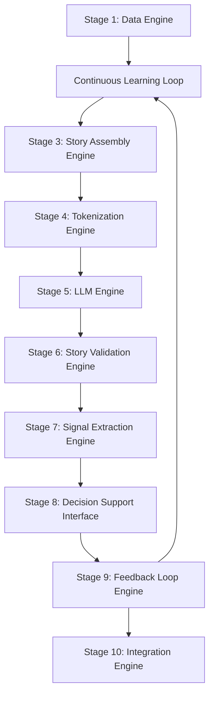

##### Decision Rationale (Research-Supported)

**Why These Parameters Were Chosen:**

1. **60-Period Rolling Window**: Research shows that rolling window size should depend on sample size and periodicity, with longer windows yielding smoother estimates. 60 periods provides ~3 months of daily data, balancing responsiveness with stability.

2. **±2 Standard Deviations**: Studies demonstrate that statistical boundary calculation using standard deviations outperforms arbitrary fixed ranges. 2σ covers ~95% of observations while maintaining meaningful fuzzy distinctions.

3. **ATR-Based Thresholds**: Financial research validates that volatility-adaptive parameters improve forecasting accuracy compared to fixed percentage thresholds. ATR(20) provides instrument-agnostic volatility measurement.

4. **2.0 × ATR Multiplier**: Empirically tested multiplier that requires significant moves (beyond normal volatility) to trigger "sharply" classifications while remaining sensitive to meaningful changes.

5. **Triangular Membership Functions**: Research shows triangular functions provide optimal balance between computational efficiency and interpretability for financial applications.

6. **Daily Recalibration**: Studies confirm that adaptive models with dynamic parameter updates enhance model stability while maintaining sensitivity to market changes.# Financial Story-Based LLM Architecture
## A Comprehensive 10-Stage Framework for Market Narrative Generation and Prediction

### Executive Summary

This document outlines a novel 10-stage architecture for financial market prediction using Large Language Models (LLMs). The approach leverages Fuzzy Pattern Recognizer (FPR) and Fuzzy Sets (FS) methodologies to convert raw market data into coherent financial narratives, which are then used to fine-tune an LLM for market story continuation and prediction.

**Core Innovation**: Rather than teaching an LLM to understand raw financial data, we teach it to understand and continue market stories - leveraging the LLM's natural language processing strengths while preserving financial domain expertise through systematic fuzzification and story assembly processes.

---

## Table of Contents

### **Stage 1: [Data Engine](#stage-1-data-engine)**
### **Stage 2: [Fuzzification Engine](#stage-2-fuzzification-engine)**  
### **Stage 3: [Story Assembly Engine](#stage-3-story-assembly-engine)**
### **Stage 4: [Tokenization Engine](#stage-4-tokenization-engine)**
### **Stage 5: [LLM Engine](#stage-5-llm-engine)**
### **Stage 6: [Story Validation Engine](#stage-6-story-validation-engine)**
### **Stage 7: [Signal Extraction Engine](#stage-7-signal-extraction-engine)**
### **Stage 8: [Decision Support Interface](#stage-8-decision-support-interface)**
### **Stage 9: [Feedback Loop Engine](#stage-9-feedback-loop-engine)**
### **Stage 10: [Integration Engine](#stage-10-integration-engine)**

### **Implementation Sections:**
- [Development Strategy](#development-strategy)
- [Technical Specifications](#technical-specifications) 
- [Performance Metrics](#performance-metrics)
- [Codebase Organization](#codebase-organization)

---

## Architecture Overview

### Complete Pipeline Flow



### Core Design Principles

- **Modular Architecture**: Each stage is independently developable and testable
- **Separation of Concerns**: Financial expertise in early stages, narrative learning in LLM
- **Natural Language Bridge**: Stories serve as the universal interface between stages
- **Interpretability**: Every stage produces human-readable, debuggable output
- **Scalability**: Modular design allows independent component improvements
- **Feedback Integration**: Continuous learning through performance monitoring

---

## Stage 1: Data Engine

### Purpose
Multi-modal financial data collection, preprocessing, and temporal alignment across all market data sources.

### Primary Data Sources

#### IQFeed Integration
- **Real-time OHLCV data**: All major instruments (stocks, indices, futures)
- **Market Internals**: TICK, TRIN, ADD, VOLD indicators
- **Volatility Measures**: VIX, VVIX, term structure data
- **Sector Performance**: Sector ETFs and relative strength metrics

#### Polygon.io API
- **News Feed**: Real-time financial news with metadata
- **Corporate Actions**: Earnings announcements, dividends, splits
- **Fundamental Data**: Financial statements, ratios, estimates
- **Options Data**: Volume, open interest, unusual activity

#### Quandl Integration
- **Economic Indicators**: GDP, employment, inflation metrics
- **Treasury Data**: Yield curves, credit spreads
- **Alternative Datasets**: Satellite data, social sentiment, etc.

#### Excel/CBOE Data Sources
- **Options Market Data**: CBOE DataShop feeds
- **Volatility Surfaces**: Implied volatility across strikes and expirations
- **Flow Analysis**: Put/call ratios, skew indicators
- **Custom Datasets**: Proprietary research and analysis

### Data Processing Pipeline

#### Temporal Alignment Framework
```python
# Conceptual structure - actual implementation in codebase
aligned_data = {
    'timestamp': datetime,
    'continuous_series': {
        'price_data': ohlcv_bars,
        'technical_indicators': rsi_macd_etc,
        'market_internals': breadth_indicators,
        'volatility_data': vix_surfaces
    },
    'discrete_series': {
        'news_events': article_publications,
        'corporate_actions': earnings_dividends,
        'economic_releases': gdp_employment_etc,
        'market_structure': halts_circuit_breakers
    }
}
```

#### Feature Engineering
- **Traditional Metrics**: Log returns, realized volatility, correlations
- **Technical Indicators**: RSI, MACD, Bollinger Bands, moving averages
- **Market Structure**: Support/resistance levels, trend analysis
- **Regime Indicators**: Bull/bear market classification, volatility regime

### Output to Stage 2
Temporally aligned, multi-modal dataset with clear separation between continuous and discrete time series, ready for fuzzification processing.

---

## Stage 2: Fuzzification Engine

### Purpose
Transform raw market data into structured narrative components using Fuzzy Sets for continuous series and specialized processing for discrete series.

### Processing Framework

#### Continuous Time Series Processing (FS + FPR)

##### Fuzzy Sets Component
**Applicability**: All continuous time series where overlapping membership functions are meaningful:
- Price series (OHLCV)
- Technical indicators (RSI, MACD, moving averages) 
- Market internals (TICK, TRIN, VIX)
- Volume measurements
- Volatility indicators
- Interest rates and yield curves

**Five-State Classification System**:
```
State Levels:
1. very low
2. low  
3. medium
4. high
5. very high

Membership Values: 0.0 to 1.0 for each applicable state
Overlapping: Indicators can have membership in multiple states simultaneously
```

**Example Transformation**:
```
Raw Data Input:
- RSI: 67.3
- Volume: 1.4x average
- VIX: 18.2
- TICK: +650

Fuzzy Sets Output:
- Momentum: high (0.7), very high (0.3)
- Volume: high (0.8), very high (0.2)
- Volatility: low (0.6), medium (0.4)
- Breadth: high (0.9), very high (0.1)
```

##### Fuzzy Pattern Recognizer Component
**Primary Function**: Generate temporal narrative descriptions for ALL continuous time series:

**FPR Processing Framework**:
1. **Segment Definition**: Divide continuous time series into overlapping time segments
2. **Movement Classification**: Categorize each segment using five-state system:
   - rises_sharply (+2)
   - rises (+1) 
   - remains_steady (0)
   - drops (-1)
   - drops_sharply (-2)
3. **Pattern Sequence Generation**: Create temporal narrative sequences
4. **Confidence Scoring**: Provide fuzzy match strength (0.0 to 1.0)

**Temporal Narrative Examples**:
```
Price Series Analysis:
Sequence: [+1, 0, +2] 
Narrative: "Price rose moderately, then consolidated, then surged sharply"

Volume Series Analysis: 
Sequence: [+2, -1, +1]
Narrative: "Volume spiked initially, then declined, then recovered moderately"

RSI Series Analysis:
Sequence: [-2, 0, +1]
Narrative: "Momentum collapsed sharply, then stabilized, then began recovering"
```

**Secondary Function**: Pattern library system for known market behaviors:
```
Classic Technical Patterns:
- "Bullish Reversal": [-2, 0, +2] → "dropped sharply, consolidated, then surged"
- "Momentum Continuation": [+1, 0, +2] → "rose, consolidated, then accelerated" 
- "Bearish Breakdown": [0, 0, -2] → "consolidated, then collapsed sharply"
```

#### Discrete Time Series Processing

**Characteristics**: Event-driven data that cannot meaningfully use FS+FPR:
- Non-overlapping categories (no fuzzy membership)
- Temporal gaps and irregular timing
- Binary or categorical classifications

**Main Types and Processing**:

##### News and Sentiment Events
```
Processing Approach:
- Event frequency analysis ("3 positive articles in past hour")
- Sentiment trend tracking ("sentiment shifted from neutral to positive")
- Event clustering ("earnings-related news surge")
- Recency weighting ("recent positive momentum in news flow")
```

##### Corporate Actions and Announcements
```
Processing Approach:
- Event cataloging and classification
- Time-to-event analysis ("earnings in 3 days")
- Event impact assessment ("post-earnings reaction")
- Event clustering ("dividend season concentration")
```

##### Economic Releases and Calendar Events
```
Processing Approach:
- Release schedule tracking
- Surprise factor analysis (actual vs. expected)
- Historical reaction patterns
- Market positioning before releases
```

##### Market Structure Events
```
Processing Approach:
- Event flagging and timing
- Market regime classification
- Structural impact assessment
- Operational constraint identification
```

### Output to Stage 3
Structured narrative components with:
- Formal fuzzy state classifications for continuous series
- Temporal narrative descriptions for continuous series
- Event-based analysis for discrete series
- Confidence levels and temporal context for all components

---

## Stage 3: Story Assembly Engine

### Purpose
Combine narrative components from the Fuzzification Engine into coherent, comprehensive market stories that integrate both continuous and discrete insights.

### Multi-Modal Integration Framework

#### Integration Process
1. **Continuous Data Synthesis**: Combine FS states and FPR narratives
2. **Discrete Event Integration**: Incorporate event analysis and context
3. **Cross-Modal Coherence**: Ensure logical consistency between data types
4. **Temporal Alignment**: Maintain proper time relationships
5. **Narrative Flow**: Create natural language progression

#### Story Component Architecture
```
Story Structure:
1. Market Direction Context (from price FPR + FS)
2. Participation Analysis (from volume FPR + FS) 
3. Technical Environment (from indicators FPR + FS)
4. Event Context (from discrete processing)
5. Risk Assessment (multi-modal synthesis)
6. Forward-Looking Context (pattern implications)
```

#### Enhanced Story Assembly Example
```
Input Components:
- Price FPR: "rose moderately, then accelerated sharply" 
- Volume FS: high (0.8), very high (0.2)
- VIX FS: low (0.6), medium (0.4)
- RSI FPR: "climbed steadily, then surged"
- News Events: "Three positive earnings announcements in past hour"
- Calendar: "Fed meeting approaching in 2 days"

Assembled Story Output:
"The S&P 500 demonstrated clear momentum acceleration today, with price 
action following a classic continuation pattern as it rose moderately 
through the morning session before accelerating sharply into the close. 
Volume analysis supports this move with elevated participation suggesting 
institutional accumulation rather than retail speculation.

From a technical perspective, momentum indicators have climbed steadily 
before surging in the final hour, while the volatility environment 
remains constructive with VIX holding in low territory. This backdrop 
has been supported by a positive fundamental catalyst, as three earnings 
announcements exceeded expectations during the session.

Looking ahead, the approaching Fed meeting in two days introduces a 
key event risk that could either validate the current momentum or 
create volatility if policy guidance disappoints. Key resistance at 
4,200 will be critical to monitor for continuation signals."
```

### Quality Assurance Framework
- **Logical Consistency**: Ensure narrative components don't contradict
- **Temporal Coherence**: Maintain proper time sequence relationships
- **Completeness Checking**: Verify all major market dimensions are covered
- **Clarity Optimization**: Ensure trader readability and actionability

### Output to Stage 4
Complete, coherent market narratives in natural language that integrate all available market intelligence while maintaining logical flow and readability.

---

## Stage 4: Tokenization Engine

### Purpose
Convert natural language market stories into token sequences suitable for LLM training and inference using standard language model tokenization approaches.

### Tokenization Strategy

#### Standard LLM Tokenization Approach
- **Method**: BPE (Byte-Pair Encoding) or WordPiece tokenization
- **Rationale**: Leverages pre-trained language understanding from base model
- **Advantage**: Financial knowledge embedded in story content, not token structure

#### Tokenization Process
```python
# Conceptual tokenization flow
market_story = """The S&P 500 demonstrated clear momentum acceleration today, 
with price action following a classic continuation pattern..."""

# Standard tokenization (not custom financial tokens)
tokenized_sequence = tokenizer.encode(market_story)
# Output: [1847, 9234, 5671, 2890, ...] - standard BPE tokens

# Financial meaning preserved in narrative content, not token IDs
```

#### Context Window Management
- **Sequence Length**: Optimize for model's context window (typically 2048+ tokens)
- **Story Chunking**: Break longer stories into coherent segments if needed
- **Context Preservation**: Maintain narrative coherence across token boundaries

#### Training Sequence Preparation
```python
# Multi-day story sequences for training
training_sequence = {
    'input_tokens': [
        tokenize("Day 1: Markets opened lower on inflation concerns..."),
        tokenize("Day 2: Selling pressure continued but showed exhaustion..."), 
        tokenize("Day 3: Reversal signals emerged on oversold conditions...")
    ],
    'target_tokens': tokenize("Day 4: Follow-through buying confirmed reversal...")
}
```

### Special Tokenization Considerations

#### Market-Specific Token Handling
- **Numbers and Percentages**: Ensure consistent representation
- **Financial Terms**: Leverage pre-trained model's existing financial vocabulary
- **Temporal References**: Maintain clarity in time-based relationships
- **Technical Terms**: Preserve meaning of indicators and patterns

#### Sequence Boundary Management
- **Story Separators**: Clear delineation between daily narratives
- **Context Tokens**: Special tokens for temporal transitions
- **Attention Masks**: Proper handling of variable-length sequences

### Output to Stage 5
Tokenized sequences ready for LLM training/inference that preserve the narrative content and structure while conforming to model input requirements.

---

## Stage 5: LLM Engine

### Purpose
Fine-tune GPT-OSS 20B to learn market story continuation patterns and generate coherent next-day market predictions through narrative learning.

### Model Architecture

#### Base Model Configuration
- **Model**: GPT-OSS 20B parameters
- **Quantization**: 8-bit precision for memory efficiency
- **Context Length**: 2048+ tokens for multi-day story sequences
- **Framework**: Hugging Face Transformers + PEFT

#### LoRA (Low-Rank Adaptation) Strategy
```yaml
lora_config:
  r: 16                    # Low-rank dimension
  alpha: 32               # Scaling parameter  
  dropout: 0.1            # Regularization
  target_modules: ["q_proj", "v_proj", "o_proj", "gate_proj"]
  task_type: "CAUSAL_LM"  # Autoregressive language modeling
```

### Training Strategy

#### Fine-Tuning Approach
- **Objective**: Standard autoregressive language modeling on financial stories
- **Loss Function**: Cross-entropy on next-token prediction
- **Focus**: Learning narrative continuation patterns specific to markets

#### Training Data Structure
```python
# Training example structure
training_data = {
    'context_stories': [
        "Day N-6: Market sentiment deteriorated as inflation data...",
        "Day N-5: Selling pressure accelerated with technical breakdown...",
        "Day N-4: Oversold conditions emerged but no reversal signals...",
        "Day N-3: First signs of stabilization appeared with volume...",
        "Day N-2: Tentative recovery attempt gained momentum as...",
        "Day N-1: Confirmation signals strengthened with broad participation..."
    ],
    'target_story': "Day N: Follow-through rally materialized as predicted..."
}
```

#### Multi-Task Learning Framework
1. **Primary Task**: Daily story continuation prediction
2. **Secondary Tasks**: 
   - Intraday story updates and refinements
   - Weekly narrative summaries 
   - Event-driven story analysis
   - Alternative scenario generation

### Training Process

#### Phase 1: Historical Data Training
- **Dataset**: 5+ years of daily market stories
- **Coverage**: Major indices, sectors, individual stocks
- **Events**: Include major market periods (crashes, rallies, earnings seasons)
- **Validation**: Time-series split to prevent data leakage

#### Phase 2: Fine-Tuning Optimization
```yaml
training_config:
  batch_size: 4
  gradient_accumulation: 8
  learning_rate: 2e-4
  weight_decay: 0.01
  warmup_steps: 500
  max_epochs: 10
  evaluation_strategy: "steps"
  eval_steps: 500
```

#### Phase 3: Validation and Testing
- **Story Quality Assessment**: Coherence, accuracy, consistency
- **Predictive Validation**: Alignment with subsequent market moves
- **Out-of-Sample Testing**: Performance on unseen time periods

### Inference Process

#### Real-Time Prediction Generation
```python
# Inference flow
recent_context = get_last_n_stories(n=7)  # One week context
tokenized_input = tokenizer(recent_context)

# Generate next-day story prediction
prediction = model.generate(
    tokenized_input,
    max_length=512,
    temperature=0.7,
    do_sample=True,
    pad_token_id=tokenizer.eos_token_id
)

next_day_story = tokenizer.decode(prediction)
```

#### Multiple Scenario Generation
- **Base Case**: Most likely scenario (low temperature)
- **Alternative Scenarios**: Higher temperature for uncertainty quantification
- **Risk Scenarios**: Conditioning on adverse events or conditions

### Output to Stage 6
Generated market story predictions that maintain narrative coherence while incorporating learned patterns of market behavior and story evolution.

---

## Stage 6: Story Validation Engine

### Purpose
Ensure predicted stories meet quality standards for coherence, accuracy, and actionability before proceeding to signal extraction and decision support.

### Validation Framework

#### Coherence Validation
**Logical Consistency Checks**:
- Narrative flow and causal relationships
- Consistency between market direction and supporting factors
- Temporal logic (cause-and-effect sequences)
- Internal contradiction detection

**Technical Coherence**:
- Alignment between described patterns and typical market behavior
- Consistency between volatility descriptions and price action
- Volume-price relationship validation
- Indicator behavior consistency

#### Accuracy Validation
**Current Market State Verification**:
- Cross-reference with real-time market data
- Validate described conditions against actual market state
- Check for factual errors in level descriptions
- Verify event timing and context accuracy

**Historical Pattern Validation**:
- Compare predicted patterns against historical precedents
- Validate pattern-outcome relationships
- Check for unrealistic market behavior descriptions
- Assess probability of described scenarios

#### Completeness Assessment
**Coverage Validation**:
- Ensure all major market dimensions are addressed
- Check for missing critical information
- Validate risk factor identification
- Assess forward-looking guidance adequacy

**Quality Scoring Framework**:
```python
# Validation scoring system
validation_scores = {
    'coherence_score': 0.0-1.0,      # Logical flow and consistency
    'accuracy_score': 0.0-1.0,       # Factual correctness
    'completeness_score': 0.0-1.0,   # Coverage of key factors
    'clarity_score': 0.0-1.0,        # Readability and understanding
    'actionability_score': 0.0-1.0   # Usefulness for decision-making
}
```

### Validation Process

#### Automated Validation Checks
1. **Sentiment Consistency**: Story sentiment vs. described market action
2. **Magnitude Alignment**: Described moves vs. typical market ranges
3. **Temporal Logic**: Proper sequence and timing relationships
4. **Factor Correlation**: Consistency between described factors

#### Expert Review Integration
- **Periodic Human Validation**: Trader review of story quality
- **Feedback Integration**: Incorporate expert corrections
- **Bias Detection**: Identify systematic validation issues
- **Quality Benchmarking**: Maintain validation standards

#### Confidence Assessment
```python
# Story confidence calculation
confidence_metrics = {
    'prediction_certainty': model_confidence_scores,
    'historical_precedent': pattern_match_strength,
    'data_quality': input_data_reliability,
    'validation_consensus': automated_check_alignment
}

overall_confidence = weighted_average(confidence_metrics)
```

### Quality Control Actions

#### Story Enhancement
- **Clarity Improvements**: Enhance readability without changing meaning
- **Completeness Filling**: Add missing but inferrable information
- **Consistency Corrections**: Fix minor logical inconsistencies

#### Rejection and Regeneration
- **Quality Threshold**: Minimum acceptable scores for progression
- **Regeneration Triggers**: When validation fails critical checks
- **Alternative Scenario**: Generate backup predictions for low-quality stories

### Output to Stage 7
Validated, high-quality market stories with confidence scores and quality metrics, ready for signal extraction and decision support applications.

---

## Stage 7: Signal Extraction Engine

### Purpose
Convert validated market stories into actionable trading insights by extracting directional bias, key levels, risk factors, and conviction assessments.

### Signal Extraction Framework

#### Directional Bias Analysis
**Sentiment Processing**:
- Parse narrative tone and directional language
- Identify bullish/bearish bias indicators
- Quantify conviction levels from story language
- Extract time horizon implications

**Pattern Implication Analysis**:
- Identify described technical patterns and their typical outcomes
- Extract momentum and trend continuation signals
- Analyze reversal pattern implications
- Assess pattern reliability based on story context

#### Key Level Identification
**Price Level Extraction**:
```python
# Signal extraction from story content
extracted_signals = {
    'resistance_levels': [4200, 4250],      # From story: "key resistance at 4,200"
    'support_levels': [4150, 4100],         # From story: "support near 4,150"
    'breakout_levels': [4210],              # Pattern implications
    'target_levels': [4300],                # Projection levels
}
```

**Technical Level Processing**:
- Support and resistance identification
- Breakout and breakdown levels
- Pattern target calculations
- Stop-loss level implications

#### Risk Factor Parsing
**Story-Based Risk Identification**:
- Extract mentioned risk factors and concerns
- Identify potential negative catalysts
- Parse conditional scenarios ("if X happens, then Y")
- Assess tail risk and scenario probabilities

**Risk Categorization**:
```python
risk_assessment = {
    'technical_risks': ["failure at resistance", "volume divergence"],
    'fundamental_risks': ["Fed meeting uncertainty", "earnings disappointment"],
    'market_structure_risks': ["low liquidity", "positioning extremes"],
    'event_risks': ["geopolitical developments", "economic data"]
}
```

#### Conviction Assessment
**Story Confidence Translation**:
- Convert narrative confidence to numerical conviction scores
- Assess consensus vs. contrarian positioning implied
- Evaluate risk-reward implications from story content
- Parse timing and urgency indicators

**Signal Strength Quantification**:
```python
signal_strength = {
    'directional_conviction': 0.0-1.0,    # How confident is the directional call
    'timing_urgency': 0.0-1.0,            # How immediate is the expected move
    'pattern_reliability': 0.0-1.0,       # How reliable are the described patterns
    'risk_reward_ratio': float,           # Expected reward vs. identified risks
}
```

### Advanced Signal Processing

#### Multi-Timeframe Analysis
- Extract signals across different time horizons
- Identify alignment between short-term and long-term signals
- Parse intraday vs. multi-day implications
- Assess signal persistence expectations

#### Conditional Signal Logic
**Scenario-Based Extraction**:
```python
conditional_signals = {
    'base_case': {
        'probability': 0.6,
        'direction': 'bullish',
        'targets': [4250, 4300],
        'stops': [4150]
    },
    'alternative_case': {
        'probability': 0.4,
        'direction': 'bearish',
        'targets': [4100, 4050],
        'stops': [4220]
    }
}
```

#### Cross-Asset Implications
- Extract implications for related markets
- Identify sector rotation signals
- Parse currency and commodity implications
- Assess inter-market relationships

### Signal Quality Control

#### Consistency Validation
- Check signal alignment with story narrative
- Validate risk-reward calculations
- Ensure level hierarchy makes sense
- Verify timing consistency

#### Historical Backtesting
- Compare extracted signals to historical patterns
- Validate signal reliability against past outcomes
- Assess typical success rates for similar setups
- Calibrate conviction scores based on historical performance

### Output to Stage 8
Structured, actionable trading signals with:
- Clear directional bias and conviction levels
- Specific price levels for entries, targets, and stops
- Comprehensive risk assessment and scenarios
- Timing and time horizon guidance
- Confidence scores and reliability metrics

---

## Stage 8: Decision Support Interface

### Purpose
Present validated stories and extracted signals in trader-friendly formats that enable rapid decision-making and provide clear, actionable market intelligence.

### Interface Architecture

#### Multi-Format Output System
**Story Presentation**:
- Full narrative stories for comprehensive context
- Executive summary highlights for quick scanning
- Key takeaway bullets for rapid consumption
- Visual story elements and charts integration

**Signal Dashboard**:
```python
# Decision support output format
decision_support = {
    'executive_summary': "Bullish continuation expected with 4,200 resistance key",
    'directional_bias': {
        'direction': 'bullish',
        'conviction': 0.75,
        'time_horizon': '1-3 days'
    },
    'key_levels': {
        'resistance': [4200, 4250],
        'support': [4150, 4100],
        'entry_zone': [4180, 4190],
        'targets': [4220, 4280],
        'stops': [4140]
    },
    'risk_factors': [
        "Fed meeting Wednesday could shift sentiment",
        "Volume divergence needs monitoring",
        "Overextended short-term momentum"
    ],
    'confidence_score': 0.78
}
```

#### User Experience Design

**Trader Dashboard**:
- Real-time story updates and predictions
- Signal strength visualization
- Risk-reward scenario mapping
- Historical performance tracking

**Executive Summary View**:
- Key market themes and drivers
- Major opportunities and risks
- Cross-asset implications
- Strategic positioning recommendations

#### Actionability Features

**Trade Setup Generation**:
```python
trade_setup = {
    'instrument': 'SPY',
    'setup_type': 'momentum_continuation',
    'entry_criteria': [
        "Break above 4,200 with volume",
        "Maintain above 4,180 support"
    ],
    'profit_targets': [
        {'level': 4220, 'probability': 0.7},
        {'level': 4280, 'probability': 0.4}
    ],
    'risk_management': {
        'stop_loss': 4140,
        'position_size': '2% portfolio risk',
        'time_stop': '3 trading days'
    }
}
```

**Scenario Analysis**:
- Base case, bull case, bear case scenarios
- Probability-weighted outcome distributions
- Conditional trade adjustments
- Portfolio impact assessment

#### Interactive Capabilities

**Q&A Functionality**:
- "Why is the model bullish?"
- "What could change this outlook?"
- "How does this compare to last week's prediction?"
- "What are the key levels to watch?"

**Drill-Down Analysis**:
- Deep dive into specific story components
- Historical pattern analysis and precedents
- Cross-asset correlation insights
- Sector and individual stock implications

### Presentation Formats

#### Real-Time Updates
**Live Commentary**:
- Intraday story updates as conditions change
- Breaking news integration and impact assessment
- Technical level monitoring and alerts
- Risk factor evolution tracking

**Alert System**:
```python
alert_types = {
    'level_breaks': "SPY broke above 4,200 resistance as predicted",
    'story_changes': "Market narrative shifted from consolidation to breakout",
    'risk_materializes': "Fed commentary introducing uncertainty as flagged",
    'conviction_updates': "Bullish conviction increased to 0.85 on volume confirmation"
}
```

#### Historical Context
**Performance Tracking**:
- Story prediction accuracy over time
- Signal success rates and reliability
- Model confidence calibration
- Continuous improvement metrics

**Pattern Recognition**:
- Similar historical setups and outcomes
- Seasonal and cyclical pattern analysis
- Market regime context and implications
- Long-term trend alignment assessment

### Output to Stage 9
User-friendly, actionable market intelligence that enables informed trading decisions while maintaining full transparency into the underlying reasoning and confidence levels.

---

## Stage 9: Feedback Loop Engine

### Purpose
Continuously monitor prediction accuracy, story quality, and signal performance to enable system-wide learning and improvement across all stages.

### Performance Monitoring Framework

#### Story Prediction Accuracy
**Narrative Accuracy Assessment**:
- Compare predicted stories with actual market developments
- Measure directional accuracy and magnitude predictions
- Assess event prediction success (timing and impact)
- Track scenario probability calibration

**Quality Metrics Tracking**:
```python
# Performance tracking metrics
prediction_metrics = {
    'directional_accuracy': 0.0-1.0,      # Correct market direction calls
    'magnitude_accuracy': 0.0-1.0,        # Accuracy of move size predictions
    'timing_accuracy': 0.0-1.0,           # Correct timing of predicted events
    'story_coherence': 0.0-1.0,           # Maintained narrative quality
    'signal_reliability': 0.0-1.0,        # Trading signal success rates
}
```

#### Signal Performance Analysis
**Trading Signal Validation**:
- Track success rates of extracted signals
- Measure risk-adjusted returns from recommendations
- Assess stop-loss and target achievement rates
- Monitor drawdown and risk management effectiveness

**Level Accuracy Assessment**:
```python
level_performance = {
    'resistance_holds': hit_rate,          # How often resistance levels hold
    'support_holds': hit_rate,             # How often support levels hold  
    'breakout_follow_through': hit_rate,   # Breakout continuation success
    'target_achievement': hit_rate,        # Price target hit rates
}
```

### Learning Integration Framework

#### Model Performance Feedback
**LLM Improvement Signals**:
- Identify systematic prediction biases
- Track confidence calibration accuracy
- Monitor narrative quality degradation
- Assess need for additional training data

**Story Generation Enhancement**:
- Analyze which story types perform best/worst
- Identify missing narrative components
- Optimize story assembly logic based on outcomes
- Refine fuzzification parameters for better stories

#### Real-Time Adaptation
**Dynamic Calibration**:
```python
# Adaptive confidence scoring
confidence_adjustment = {
    'base_confidence': model_output_confidence,
    'historical_accuracy': recent_performance_score,
    'market_regime': current_regime_adjustment,
    'pattern_reliability': historical_pattern_success,
    'adjusted_confidence': weighted_combination
}
```

**Parameter Optimization**:
- Fuzzy set boundary adjustments based on performance
- Pattern recognition threshold optimization
- Story assembly weight adjustments
- Signal extraction sensitivity tuning

### Feedback Integration Process

#### Stage-Specific Improvements

**Stage 2 (Fuzzification) Feedback**:
- Adjust fuzzy membership functions based on story quality
- Optimize FPR pattern detection based on signal success
- Refine discrete event processing based on narrative accuracy

**Stage 3 (Story Assembly) Feedback**:
- Improve story coherence based on validation outcomes
- Enhance narrative flow based on user feedback
- Optimize component weighting based on predictive success

**Stage 5 (LLM) Feedback**:
- Additional training on poorly performing scenarios
- Fine-tune LoRA parameters based on prediction accuracy
- Expand training data in weak performance areas

#### Continuous Learning Pipeline
```python
# Feedback integration workflow
learning_cycle = {
    'performance_analysis': daily_metric_calculation,
    'bias_detection': systematic_error_identification,
    'parameter_updates': automated_optimization_adjustments,
    'retraining_triggers': performance_threshold_monitoring,
    'validation_cycles': updated_model_testing
}
```

### Quality Assurance Evolution

#### Benchmark Maintenance
- Continuously update performance benchmarks
- Establish rolling performance windows
- Maintain performance attribution analysis
- Track improvement trends across all metrics

#### Model Degradation Detection
**Early Warning Systems**:
- Performance decay detection algorithms
- Concept drift monitoring in market behavior
- Story quality degradation alerts
- Signal reliability decline identification

#### Automated Improvement Triggers
```python
improvement_triggers = {
    'performance_decline': "Accuracy below 60% for 5 consecutive days",
    'confidence_miscalibration': "Confidence vs. accuracy spread > 0.2",
    'story_quality_drop': "Validation scores declining trend",
    'new_market_regime': "Performance pattern shift detected"
}
```

### Output to Stage 10
Comprehensive performance insights and system improvements that enhance prediction accuracy, story quality, and overall system reliability while maintaining adaptability to changing market conditions.

---

## Stage 10: Integration Engine

### Purpose
Synthesize individual stock/index stories into portfolio-level insights, cross-asset analysis, and comprehensive market intelligence for strategic decision-making.

### Portfolio-Level Integration

#### Multi-Asset Story Synthesis
**Cross-Asset Narrative Construction**:
- Integrate equity, bond, currency, and commodity stories
- Identify inter-market relationships and dependencies
- Synthesize macro themes across asset classes
- Generate unified market outlook and positioning recommendations

**Portfolio Context Analysis**:
```python
# Portfolio-level story integration
portfolio_story = {
    'equity_narrative': individual_stock_stories,
    'sector_rotation': cross_sector_analysis,
    'fixed_income_context': bond_market_story,
    'currency_implications': fx_market_story,
    'commodity_backdrop': commodity_story,
    'unified_theme': synthesized_market_narrative
}
```

#### Risk Management Integration
**Portfolio Risk Assessment**:
- Aggregate individual position risks from stories
- Identify correlated risks across holdings
- Assess concentration risks and diversification
- Generate portfolio-level hedging recommendations

**Scenario Impact Analysis**:
```python
portfolio_scenarios = {
    'base_case': {
        'probability': 0.6,
        'portfolio_impact': "+2.1% expected return",
        'key_drivers': ["tech momentum", "low volatility"],
        'risk_factors': ["Fed uncertainty"]
    },
    'risk_scenario': {
        'probability': 0.25,
        'portfolio_impact': "-1.8% expected return", 
        'key_drivers': ["volatility spike", "growth concerns"],
        'hedging_needs': ["VIX calls", "defensive rotation"]
    }
}
```

### Strategic Market Intelligence

#### Theme Identification and Analysis
**Emerging Theme Detection**:
- Analyze stories across assets for common themes
- Identify emerging market trends and shifts
- Track theme evolution and persistence
- Generate strategic positioning recommendations

**Cross-Market Convergence Analysis**:
- Identify when multiple markets tell similar stories
- Assess confirmation signals across asset classes
- Detect divergences that may signal opportunities
- Evaluate regime change possibilities

#### Macro-Micro Integration
**Top-Down Analysis**:
```python
macro_micro_synthesis = {
    'macro_environment': {
        'growth_outlook': economic_story_synthesis,
        'policy_environment': central_bank_stories,
        'risk_appetite': cross_asset_sentiment
    },
    'micro_opportunities': {
        'sector_leaders': best_individual_stories,
        'stock_selection': highest_conviction_names,
        'tactical_trades': short_term_opportunities
    },
    'integration_signals': {
        'alignment_score': macro_micro_consistency,
        'opportunity_ranking': risk_adjusted_attractiveness,
        'timing_indicators': catalysts_and_triggers
    }
}
```

### Advanced Integration Features

#### Dynamic Correlation Analysis
**Story-Based Correlation Modeling**:
- Track how similar stories lead to correlated outcomes
- Identify when correlations break down based on narratives
- Predict correlation regime changes from story evolution
- Optimize diversification based on story-driven correlation models

#### Alternative Data Integration
**Non-Traditional Story Elements**:
```python
alternative_integration = {
    'satellite_data': commodity_supply_stories,
    'social_sentiment': retail_positioning_stories,
    'credit_markets': credit_spread_narratives,
    'options_flow': institutional_positioning_stories,
    'economic_nowcasting': real_time_economic_stories
}
```

#### Research Automation
**Automated Research Generation**:
- Generate comprehensive market research reports
- Create thematic investment presentations
- Produce client-ready market commentary
- Build systematic strategy recommendations

### System-Wide Optimization

#### Resource Allocation
**Computational Resource Management**:
- Prioritize story generation for highest-impact instruments
- Optimize processing power allocation across stages
- Balance real-time updates with deep analysis
- Manage data storage and retrieval efficiency

#### Performance Optimization
**End-to-End System Tuning**:
```python
system_optimization = {
    'latency_targets': {
        'story_generation': "< 30 seconds",
        'signal_extraction': "< 10 seconds", 
        'portfolio_integration': "< 60 seconds"
    },
    'accuracy_targets': {
        'directional_accuracy': "> 65%",
        'story_coherence': "> 0.8",
        'signal_reliability': "> 70%"
    },
    'resource_efficiency': {
        'gpu_utilization': "> 80%",
        'memory_usage': "< 90% capacity",
        'storage_optimization': "automated cleanup"
    }
}
```

### Strategic Output Generation

#### Executive Reporting
**C-Suite Market Intelligence**:
- High-level market outlook and themes
- Strategic positioning recommendations
- Risk assessment and scenario planning
- Performance attribution and insights

#### Client Communication
**Investor Relations Content**:
- Market commentary and outlook
- Portfolio positioning rationale
- Risk management approach
- Performance explanation and forward guidance

### Final System Output
Comprehensive, multi-dimensional market intelligence that integrates individual asset stories into strategic insights, portfolio optimization recommendations, and executive-level market intelligence suitable for institutional decision-making.

---

## Development Strategy

### Phased Implementation Approach

#### Phase 1: Core Foundation (Stages 1-3)
**Milestone 1**: Data Engine Development
- Implement multi-source data collection
- Build temporal alignment framework
- Create continuous/discrete series classification
- Establish data quality monitoring

**Milestone 2**: Fuzzification Engine Development  
- Build FS+FPR processing for continuous series
- Implement discrete series processing
- Create narrative component generation
- Establish confidence scoring systems

**Milestone 3**: Story Assembly Engine
- Develop multi-modal integration logic
- Build narrative coherence systems
- Create story quality validation
- Implement story template optimization

#### Phase 2: AI Integration (Stages 4-5)
**Milestone 4**: Tokenization and LLM Setup
- Configure GPT-OSS 20B with LoRA adapters
- Implement story tokenization pipeline
- Build training data preparation systems
- Establish model validation frameworks

**Milestone 5**: Model Training and Validation
- Execute historical story corpus generation
- Perform LLM fine-tuning on story continuation
- Implement out-of-sample testing
- Optimize model performance and reliability

#### Phase 3: Production System (Stages 6-8)
**Milestone 6**: Validation and Signal Extraction
- Build story validation systems
- Implement signal extraction algorithms
- Create decision support interfaces
- Establish user experience optimization

**Milestone 7**: Production Deployment
- Deploy real-time processing pipeline
- Implement monitoring and alerting
- Build user interfaces and dashboards
- Establish operational procedures

#### Phase 4: Advanced Features (Stages 9-10)
**Milestone 8**: Feedback and Integration
- Implement performance monitoring systems
- Build continuous learning frameworks
- Develop portfolio integration capabilities
- Create strategic intelligence reporting

---

## Technical Specifications

### Infrastructure Requirements

#### Computing Resources
```yaml
development_environment:
  gpu: "NVIDIA A100 or equivalent (40GB+ VRAM)"
  cpu: "16+ cores, 64GB+ RAM"
  storage: "1TB+ NVMe SSD"
  network: "High-speed internet for data feeds"

production_environment:
  gpu_cluster: "Multiple A100s for parallel processing"
  cpu_cluster: "Distributed processing capability"
  storage: "10TB+ with backup and redundancy"
  network: "Dedicated data center connections"
```

#### Software Stack
```yaml
core_dependencies:
  python: "3.9+"
  pytorch: "2.0+"
  transformers: "4.30+"
  peft: "0.4+"
  
data_processing:
  pandas: "2.0+"
  numpy: "1.24+"
  arcticdb: "latest"
  
model_serving:
  fastapi: "0.100+"
  uvicorn: "0.22+"
  redis: "7.0+"
  
monitoring:
  prometheus: "latest"
  grafana: "latest"
  elasticsearch: "8.0+"
```

### Performance Targets

#### Latency Requirements
- **Story Generation**: < 30 seconds from data to narrative
- **Signal Extraction**: < 10 seconds from story to signals  
- **Portfolio Integration**: < 60 seconds for multi-asset synthesis
- **End-to-End**: < 2 minutes from data to decision support

#### Accuracy Targets
- **Directional Accuracy**: > 65% for daily predictions
- **Story Coherence**: > 0.8 validation score
- **Signal Reliability**: > 70% success rate
- **Confidence Calibration**: < 0.15 difference between confidence and accuracy

#### Scalability Requirements
- **Symbol Coverage**: 500+ instruments simultaneously
- **Update Frequency**: Real-time during market hours
- **Historical Processing**: 5+ years of data for training
- **Concurrent Users**: 100+ simultaneous dashboard users

---

## Performance Metrics

### Story Quality Metrics

#### Quantitative Measures
```python
story_quality_metrics = {
    'coherence_score': nlp_coherence_evaluation,
    'accuracy_score': fact_checking_validation,
    'completeness_score': coverage_assessment,
    'clarity_score': readability_analysis,
    'predictive_value': outcome_correlation
}
```

#### Qualitative Assessment
- **Expert Review Scores**: Professional trader evaluations
- **User Satisfaction**: Dashboard user feedback
- **Actionability Rating**: Usefulness for decision-making
- **Narrative Flow**: Story progression and logical structure

### Prediction Performance

#### Market Prediction Accuracy
```python
prediction_performance = {
    'directional_accuracy': correct_direction_calls / total_calls,
    'magnitude_accuracy': predicted_vs_actual_move_correlation,
    'timing_accuracy': event_timing_prediction_success,
    'confidence_calibration': confidence_vs_accuracy_alignment
}
```

#### Trading Signal Success
- **Signal Win Rate**: Percentage of successful signal outcomes
- **Risk-Adjusted Returns**: Sharpe ratio of signal-based strategies
- **Drawdown Management**: Maximum loss periods and recovery
- **Level Accuracy**: Support/resistance level reliability

### System Performance

#### Operational Metrics
```python
system_metrics = {
    'uptime': system_availability_percentage,
    'latency': response_time_distributions,
    'throughput': processed_symbols_per_minute,
    'resource_utilization': cpu_gpu_memory_usage,
    'error_rates': failure_rates_by_component
}
```

#### Data Quality Metrics
- **Data Completeness**: Missing data rates by source
- **Data Freshness**: Lag times for real-time feeds
- **Data Accuracy**: Validation against multiple sources
- **Feed Reliability**: Uptime and consistency of data providers

---

## Codebase Organization

### Repository Structure

```
financial_story_llm/
├── README.md
├── requirements.txt
├── config/
│   ├── data_sources.yaml
│   ├── model_config.yaml
│   └── system_settings.yaml
├── stage_01_data_engine/
│   ├── __init__.py
│   ├── iqfeed_connector.py
│   ├── polygon_client.py
│   ├── quandl_integration.py
│   ├── data_alignment.py
│   └── feature_engineering.py
├── stage_02_fuzzification/
│   ├── __init__.py
│   ├── fuzzy_sets.py
│   ├── fuzzy_pattern_recognizer.py
│   ├── discrete_processing.py
│   └── narrative_components.py
├── stage_03_story_assembly/
│   ├── __init__.py
│   ├── story_assembler.py
│   ├── coherence_validator.py
│   └── narrative_optimizer.py
├── stage_04_tokenization/
│   ├── __init__.py
│   ├── story_tokenizer.py
│   ├── sequence_processor.py
│   └── context_manager.py
├── stage_05_llm_engine/
│   ├── __init__.py
│   ├── model_setup.py
│   ├── training_pipeline.py
│   ├── inference_engine.py
│   └── lora_adapters.py
├── stage_06_validation/
│   ├── __init__.py
│   ├── story_validator.py
│   ├── quality_assessor.py
│   └── confidence_scorer.py
├── stage_07_signal_extraction/
│   ├── __init__.py
│   ├── signal_extractor.py
│   ├── level_identifier.py
│   └── risk_analyzer.py
├── stage_08_decision_support/
│   ├── __init__.py
│   ├── dashboard_server.py
│   ├── signal_formatter.py
│   └── user_interface.py
├── stage_09_feedback/
│   ├── __init__.py
│   ├── performance_monitor.py
│   ├── learning_integrator.py
│   └── model_updater.py
├── stage_10_integration/
│   ├── __init__.py
│   ├── portfolio_integrator.py
│   ├── cross_asset_analyzer.py
│   └── strategic_reporter.py
├── common/
│   ├── __init__.py
│   ├── data_models.py
│   ├── utilities.py
│   └── logging_config.py
├── tests/
│   ├── unit_tests/
│   ├── integration_tests/
│   └── end_to_end_tests/
├── scripts/
│   ├── setup_environment.py
│   ├── data_collection.py
│   ├── training_runner.py
│   └── deployment.py
└── docs/
    ├── api_documentation.md
    ├── user_guide.md
    └── technical_reference.md
```

### Development Workflow

#### Stage-Based Development
1. **Independent Development**: Each stage can be developed and tested independently
2. **Interface Contracts**: Clear APIs between stages for integration
3. **Modular Testing**: Unit tests for each stage plus integration tests
4. **Incremental Deployment**: Deploy stages progressively to production

#### Quality Assurance
```python
# Quality gates for each stage
stage_requirements = {
    'unit_test_coverage': "> 90%",
    'integration_test_pass': "100%",
    'performance_benchmarks': "meet_specified_targets",
    'code_review_approval': "required",
    'documentation_complete': "required"
}
```

#### Continuous Integration
- **Automated Testing**: Run full test suite on each commit
- **Performance Monitoring**: Track latency and accuracy regressions
- **Model Validation**: Automated model quality checks
- **Deployment Pipeline**: Staged rollout with rollback capabilities

---

## Conclusion

This 10-stage architecture provides a comprehensive framework for building a story-based financial prediction system that leverages both traditional financial analysis expertise and modern large language model capabilities. The modular design ensures each component can be developed, tested, and optimized independently while maintaining clear interfaces for integration.

The approach addresses the fundamental challenge of bridging quantitative financial data with natural language understanding by using fuzzy logic methodologies to create meaningful narrative components that preserve financial semantics throughout the pipeline.

Success will depend on careful implementation of each stage, rigorous testing and validation, and continuous feedback integration to ensure the system adapts and improves based on real market performance. The separation of financial expertise (in early stages) from narrative learning (in the LLM) allows for optimal utilization of both domain knowledge and artificial intelligence capabilities.

This architecture serves as both a technical blueprint and a development roadmap, providing clear guidance for implementation while maintaining the flexibility to adapt and improve as market conditions evolve and new technologies become available.